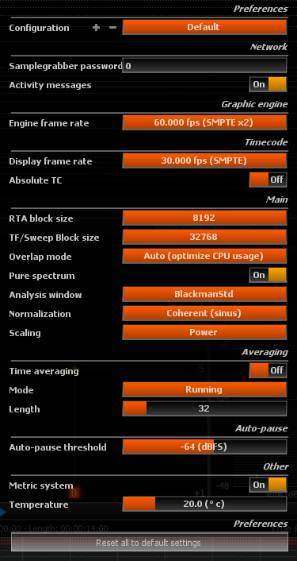
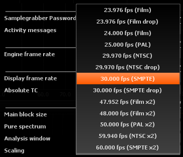
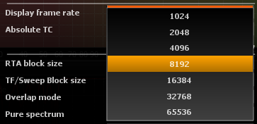
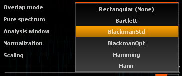

# Main setup

<link type="document" target="Main">Main</link>
setup dialog

## Configuration
Save / restore a user-defined configuration to and from disk,
including all the settings in this panel, as well as <link type="document" target="IO Configuration">IO
Configuration </link> and <link type="document" target="UI Setup">UI Setup</link>.

## SampleGrabber
**SampleGrabber password**

The password entered in this field should match the one used by the SampleGrabber you wish to use as
a source. This provides a reasonable level a security and prevents unauthorized access to your audio
material broadcast over the network. Please take into consideration the encryption used only
provides moderate protection, and is not intended to replace other security guards such as firewalls
etc.

## Graphic engine

Available graphic engine frame rates

Here you can specify the rate at which the display should be refreshed. Please note higher frame
rates place higher demands on the GPU, and to a lesser extent, on the CPU.

>The effective frame rate can be displayed by typing `SetRenderStats(1)` in the console.

## Time code

Available display frame rates

### Display frame rate
Sets the frame-rate used for time display in various parts of
the program. Set it to match the frame-rate of your source material to facilitate locating time
events, when working with film, TV or other time-stamped material.

### Absolute Timecode
This settings toggles between absolute and relative time-code display
formats. Absolute Timecode is taken from the time the application was started. Relative Timecode is
the time-elapsed since the Timecode offset position. See <link type="document" target="Usage meter hist">metering
history usage</link> for information on working with Timecode.

## Main

### RTA block size

Defines the size of the blocks, in samples, fed to the main spectrum analyzer engine, which is used
by the spectrum magnitude, Nebula and spectrogram views.

Pure spectrum Toggles between optimized frequency analysis (default) and standard FFT.

### TF/Sweep Block size

Block size used for the transfer function and snapshot performed with sine-sweep. The default is
32768, which is appropriate for most cases.

Increasing this value gives better frequency resolution, at the expense of CPU load. Lower values
can be employed if you're only interested in the overall response of the analyzed system.

### Overlap Mode

The overlap mode setting determines how much incoming audio frames overlap each-other. A higher
overlap results in a smoother display update, at the expense of increased CPU usage. The available
settings are

* Full: highest overlap
* Auto: optimizes overlap depending on available CPU resources (Default).
* Less: minimizes overlap for minimal CPU usage (useful for slow machines)

### Analysis window

Selects the analysis window applied to the incoming blocks.

Available choices are:

* Rectangular (None).
* Bartlett.
* Blackmann standard (default).
* Blackmann optimized.
* Hamming.
* Hann.

There is no reason to change this setting unless you have a specific reason to do so and fully
understand the implications.

### Normalization

Selects the normalization mode used to normalize the global gain of the spectrum display.

Available choices are:

* Coherent (sinus). 0dB peak sine gives 0dB amplitude
* Incoherent (noise/music). 0dB <link type="document" target="RMS">RMS</link> noise or music
gives 0dB power

### Scaling

This setting controls the frequency dependent amplitude spectrum correction curve.

Available choices are:

* Amplitude: equivalent to no scaling. Amplitude of pure tones at different frequencies
register at the same value. Incoming white noise is displayed as a (quasi) flat curve.

* Power (default): scaling inversely proportional to frequency (1/f). Incoming pink noise is
displayed as a flat curve.

## Averaging

<link type="document" target="Time">Time</link>
averaging

Engages averaging of spectrum magnitudes over time. Default is off.

### Mode

* Running: the average display is updated as soon as a new incoming block arrives. This is the
default.

* Fill-freeze: the display is only updated when a fresh batch of N new incoming blocks has
arrived. The display is frozen until the next batch of N blocks arrive, and so on. N
corresponds to the length setting defined below.

### Length
The number of incoming blocks over which the resulting average spectrum
is computed. Lower values lead to faster apparent display update rates, while higher values
smooth-out any time-variations more. Default is 32.

>Running average employs a weighting window that gives more importance to the last incoming
blocks of samples. This type of time averaging is also called <i>moving average</i>, <i>rolling
average</i> or <i>running average</i>, and is good for smoothing out abrupt variations in time and still be
able to monitor in a continuous fashion.
Fill-freeze mode is useful for stabilizing a flickering display while still following long-term
variations, which permits a more detailed study of the curve(s). This mode is therefore useful to
get a very steady picture of the spectrum while still monitoring some of the mid-term changes, and
saves you from holding and resetting the display manually again and again.

## Various

### Auto-pause threshold
Analysis is paused whenever the level of any channel of
the incoming audio falls below this level. Set this a tad above the acoustic and electronic noise
floor of your input signal chain to retain measurements even though the audio (music program or test
signal) has stopped.

### Metric system
Toggle displayed units between:

* Metric system (default): distance expressed in meters, temperature in degrees Celsius.
* Imperial units: distance expressed in inches and feet, temperature in degrees Fahrenheit.

### Temperature
This should be set to the ambient temperature at the current
location in order to get the most accurate time to distance conversions in the delay finder and
impulse response panels. The following table gives an idea of how much the speed of sound varies
with temperature.

<table>
<tr>
<td>Temperature (°C)</td>
<td>Speed of sound (m/s)</td>
</tr>
<tr>
<td>0</td>
<td>331.3</td>
</tr>
<tr>
<td>15</td>
<td>340.31</td>
</tr>
<tr>
<td>25</td>
<td>346.18</td>
</tr>
<tr>
<td>35</td>
<td>351.96</td>
</tr>
</table>

### Preferences reset
Resets "Default" application configuration settings to their
default initial value. Please note the changes are only effective after restarting the application.

