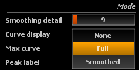
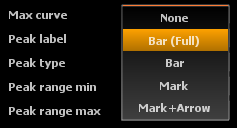

# Smoothing mode
Switches between Window (the default) and various per-octave smoothing types.

When <i>Window</i> type is selected, a sliding window average of adjustable width is applied to the
curve, which results in more or less frequency detail being removed, depending on the <link
type="document" target="Smoothing detail">Smoothing detail</link> setting.

When any of the Octave types are selected, the average of the spectrum over the corresponding ISO
bands is displayed, as as series of horizontal bars. The following series are available
* Octave
* 2/3 octave
* 1/2 octave
* 1/3 octave
* 1/6 octave
* 1/12 octave

# Smoothing detail
<link type="document" target="Controls">Controls</link>
the amount of frequency detail of the smoothed curve, when using window smoothing. The value roughly
corresponds to the maximum number of valleys and peaks that can stand out the smoothed curve. A low
value lets the global tendency of the amplitude spectrum pass through, while values above 20 or so
preserve more detail such as harmonics and sharp equalizer cuts and boosts. Default is 3.

> This curves acts as a kind of zoom-out control, as it shows the global frequency content of the
signal, leaving out details such as harmonic peaks and variations imputable to transient and noise
components. Typical uses for this curve is to monitor the global frequency balance of a mix and to
visualize the influence of broad equalizer corrections on the mix.

# Curve display

Toggles between the following curve display modes:
* Full: main curve only (no smoothing)
* Smoothed: smoothed curve only
* All: both unsmoothed and smoothed curves

> Selecting one of the first two modes is recommended to avoid display clutter when comparing
several channels and/or snapshots.

# Max curve

The max curve employs much longer release time compared to the main curve, and as such registers
short peaks much more easily.

The max curve setting controls its visibility and wether smoothing is applied:
* None: curve not displayed
* Full: visible, unsmoothed
* Smoothed: visible, smoothed

> The max curve is never displayed for snapshots, as it would be the same as the
main curve, since this type of curve does not evolve in time.

# Peak type

This setting controls the manner in which spectrum magnitude peaks are computed:
* Max (global): compute a global maximum over the entire spectrum range.
* Max (user): compute the maximum across a user defined portion of the spectrum set in
the <link type="document" target="Peak range">Peak range</link>.

# Peak label

Determines the appearance of the peak display:
* None: peaks are not shown.
* Bar (Full): vertical bar at current peak located at current frequency.
* Bar: vertical bar from base to peak value.
* Mark: text box indicating peak value, in dB, and frequency (Hz) at peak location.
* Mark + Arrow: same as above, with text at the top of the display and arrow pointing at peak
location. This is the most precise indication, but takes up more space.

# Peak range
Used in combination with the <i>Max (user)</i>
<link type="document" target="Peak">Peak</link> type setting, this defines the minimum and maximum
frequencies to take into account when computing the peak.

