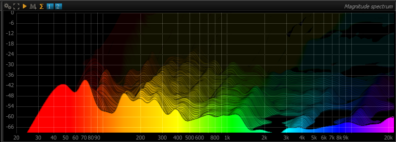

# Slide (Real Time waterfall)

# Enable
<link type="document" target="Enable">Enable</link>/disable the slide mode

# Direction
Define the sliding <link type="document" target="Direction">Direction</link>. From -5 to 5.

Default is 0

# Fading
<link type="document" target="Controls">Controls</link>
display persistence, <i>i.e.</i> the "fade to black" amount for a frame. Lowering this value retains
past particles longer, whereas increasing this make them disappear faster.

# Blur
<link type="document" target="Enable">Enable</link> / Disable sliding blur.

# Blur Kernel Size

<link type="document" target="Controls">Controls</link>
the radius of the blur effect applied to past particles. Particles are "smeared" more and more as
they become older, depending on this setting. Naturally, a bigger value increases the smearing, at
the expense of processing power.

> Choosing the value for this setting is really matter of taste, although please
keep in mind values that above 5 will require a sufficiently powerful graphics card in order 
to maintain a responsive display.

