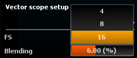
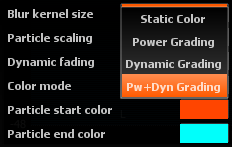

# Display

Vector scope setup options

# Fs

Over-sampling factor in multiples of FS, that is the incoming audio is up-sampled as necessary to
reach this multiple times 48kHz. Increasing this value increases the display precision and
reactivity, at the expense of a little CPU overhead.

# Blending
<link type="document" target="Controls">Controls</link>
the amount of particle blending with the current image, from 1 to 100%. A higher value gives more
priority to the incoming audio over past frames.

# Fading
<link type="document" target="Controls">Controls</link>
display persistence, <i>i.e.</i> the "fade to black" amount for a frame. Lowering this value retains
past particles longer, whereas increasing this make them disappear faster.

# Size factor
<link type="document" target="Controls">Controls</link>
the size of individual particles with respect to screen size.

# Blur kernel size
<link type="document" target="Controls">Controls</link>
the radius of the blur effect applied to past particles. Particles are "smeared" more and more as
they become older, depending on this setting. Naturally, a bigger value increases the smearing, at
the expense of processing power.

>Choosing the value for this setting is really matter of taste, although please
keep in mind values that above 5 will require a sufficiently powerful graphics card in order to 
maintain a responsive display.

# Color mode

This defines how the particle color is determined:
* Static color: use only particle start color (see below)
* Power grading: color is modulated by overall signal <link type="document" target="RMS">RMS</link> power
* Dynamic grading: color is modulated by signal dynamics
* Pw+Dyn grading: mix of the two previous modes

# Particle start/end colors
Sets the particle color range to be used.

