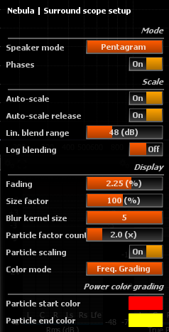
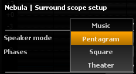
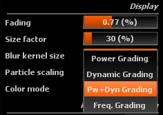

# Display

Nebula | Surround scope setup options

# Mode
## Speaker mode

Selects between various commonly employed surround speaker arrangements.

## Phases
Toggles phase-correlation display on and off.

# Scale
## Auto-scale
This parameter controls whether the intensity of the particles are modulated by the overall
audio level variations. In essence, when enabled, the color nuances will vary according to the
relative amplitude of a frequency, allowing to monitor the relative amplitude spectrum
variations. When disabled, the color will reflect the absolute audio level. You can also think
of this as a kind of auto-gain setting.

## Auto-scale release
This controls whether color variations should be smoothed in time or not. When engaged, color
variations is slowed down a bit, which makes overall level transitions more obvious.

>You should to enable this setting when you want to visualize quick level
variations such as those that frequently occur in movie soundtracks.

## Linear blend range
Adds a constant blend amount to the particle. This ensures some of the particle is always
blended into the image even if its original magnitude is low.

A low value for this setting has the effect of stabilizing the appearance of particles. With
large values more of the spectrum dynamics are taken into account, and only peaks mostly come
through.

## Log blending
Toggles between linear and logarithmic blending of the current particle with old particles.

The default is off, ie. linear blending, which tends to favor the display of peaks.

Logarithmic blending on the other hand preserves more of the full dynamic range of the data, and
gives some visibility to lower levels also.

# Display

## Fading

<link type="document" target="Controls">Controls</link>
display persistence, <i>i.e.</i> the "fade to black" amount for a frame. Lowering this value
retains past particles longer, whereas increasing this make them disappear faster.

## Size factor

<link type="document" target="Controls">Controls</link>
the size of individual particles with respect to screen size.

## Blur kernel size

<link type="document" target="Controls">Controls</link>
the radius of the blur effect applied to past particles. Particles are "smeared" more and more
as they become older, depending on this setting. Naturally, a bigger value increases the
smearing, at the expense of processing power.

>Choosing the value for this setting is really matter of taste, although please
keep in mind values that above 5 will
require a sufficiently powerful graphics card in order to maintain a responsive display.

## Particle factor count
Determines the amount of particles to display, relative to the default number used for the
current screen size.

## Particle scaling
Toggles automatic adjustment of particle size with screen size. When enabled, the overall
aspect of the display will remain similar even if the view size changes.

## Color mode
This defines how the particle color is determined:
* Power grading: color is modulated by overall signal <link type="document" target="RMS">
RMS </link> power.
* Dynamic grading: color is modulated by signal dynamics.
* Pw+Dyn grading: mix of the two previous modes.
* Freq. grading: color is modulated by frequency.

# Power color grading
Determines the start and end colors used with "Power grading" color mode selected.
