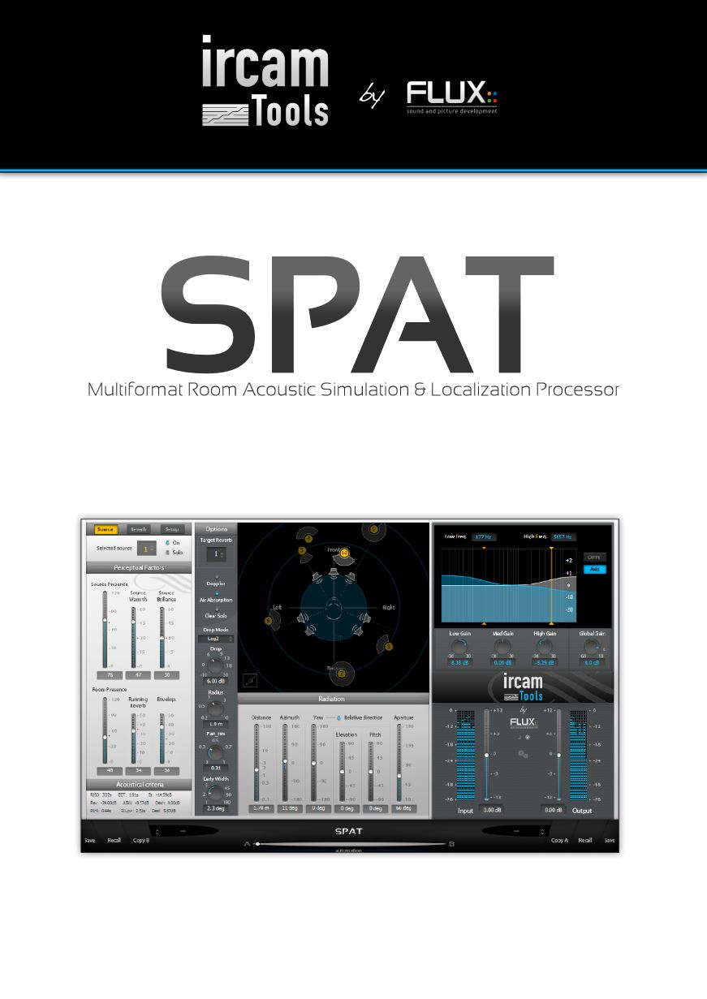

## Introduction

The Spat is a very powerful tool for spatialization. It can handle both aspects of spatialization (source localization 
and room acoustic simulation) in a very homogeneous and coherent way. A set of sources (up to eight in this plug-in, 
may be linked in stereo pairs) are localized in a 3D space (in the Source control tab). Each of these source is 
connected to a room (also called reverb).  
Up to 3 rooms are available in parallel, in order to simulate complex spaces (coupled room acoustics...).

## Perceptual factors Vs. Acoustical criteria

In both sources edition and reverb edition, controls are available as a set of "perceptual factors". Each of these parameters 
corresponds to a real-world criterion that actually has proper significance in terms of hearing perception, and not some obscure
algorithm-specific parameter translating more-or-less to some kind of aesthetic interpretation. This is a feature unique to the
Spat, which is the result of substantial research and development work at IRCAM and Flux, providing a relationship between
these parameters and the plug-in internal parameters. Internally, the plug-in perceptual mapper translates the GUI parameters
into a much larger set of parameters required for the actual reverb engine computations.

This way the complexities of the reverb algorithm internals are hidden from the user so one can make predictable and guided
adjustments, instead of having to resort to a "poke in the dark" approach, adjusting settings at semi-random trying to find some
"magical" combination of parameters to obtain the desired result.

In parallel, a display is detailing the "acoustical criteria", these parameters are more familiar for those who are well acquainted
with acoustics, and here instead will find the more commonly used terms.

