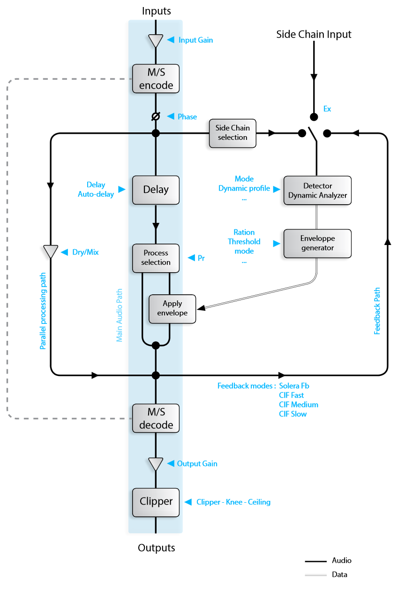
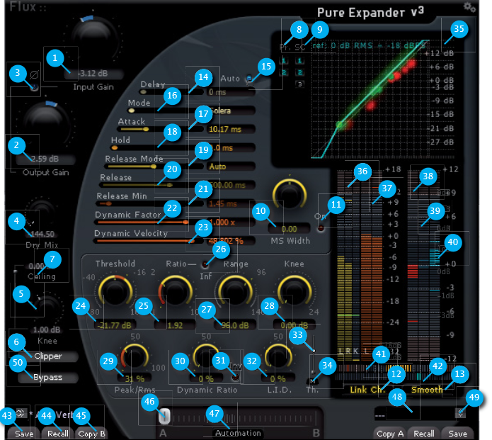

# Pure Expander V3
[Product Page](https://www.flux.audio/project/pure-expander/) 
| [Shop Page](https://shop.flux.audio/en_US/products/pure-expander)

Pure Expander is the expander section of the Solera. An expander is used to automatically reduce the gain below the 
Threshold. The exclusive Dynamic Ratio algorithm developed by Flux:: allows you to remove unwanted noises or reverberation
without adding a processed character to your sound. Pure Expander produces a wide range of expansion process from
subtle expansions to hard noise-gate.

The Threshold value is expressed in dB - The plug-in compares it to the RMS (Root Mean Square or effective power) of the
input signal. This value is displayed as a green rectangle on the input level meter. The level variations below the threshold
are affected by the Ratio value. For a 1:1 expansion ratio, the processed signal isn’t affected by the processing: 
A 1 dB variation below the threshold at the input is reflected by a 1 dB variation at the output.

Try applying a 1:3 ratio, if the input signal falls below 1 dB the threshold value, the output signal falls from 3 dB: Here is the
expander action. The input signal gain is reduced by a 3:1 ratio below the threshold point.

The Knee sets how progressive is the start up of the compressor action – In other words, It smoothes the transition point
between no processing and full processing. If the Knee value expressed in dB is increased, the progressiveness of the action
will be spread below and above the threshold point.

The Range value sets the processing maximum action. No gain variation can exceed this value.
