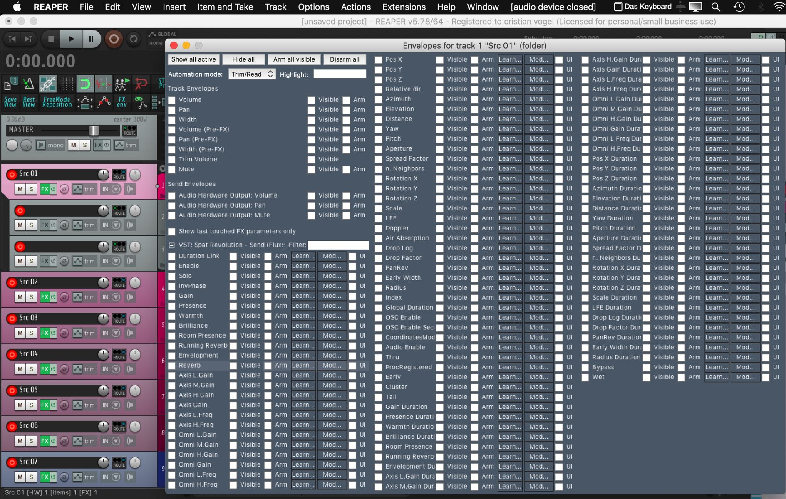

# 10.1 DAW Automation - Local Audio Path 

Whenever a Spat SEND plug-in is initiated in your DAW and you have enabled the
local audio path workflow (see section 7.3) the plug-in automatically establishes a
parameter control connection with the current Spat Revolution project. You can
then automate every parameter available via the Spat plug-in from your DAW automation lanes, with no further configuration.

In the above screenshot, you see the _Reaper_ DAW display all available automation
parameters in a Spat SEND plug-in. Just arm and record or manually create automation lanes for the parameters you want to automate.

!> _Spat ROOM Plug-in automation requires manual OSC set up_

