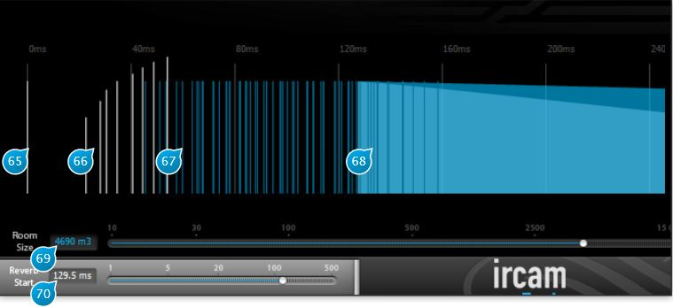

# Display

## (65) Direct signal
The grey bar at the start of the reverberation pictogram represents the direct sound send at the input of the plug-in. 
In the time structure of the reverberation, it is the first element that is heard.

## (66) Early
Overall representation of the early reflections distribution. Vertical bars roughly indicate at what time locations 
(horizontally) and levels (bar height) these early reflections occur.

## (67) Cluster
Overall representation of the cluster reflections distribution. Vertical bars roughly indicate at what time locations 
(horizontally) and levels (bar height) these early reflections occur.

## (68) Reverb
Shows a graphical representation of the reverberation tail part of the engine. The decay curves of the high, mid and low
bands, which are controlled by the decay time settings, are superimposed in different colors and can rapidly be assessed
and checked.  
Also see 12.

## (69) Room Size
This is a meta-parameter that takes care of varying several other parameters in order to quickly set the equivalent size of
the virtual room, adjusting early, cluster and tail reverb parameters to match the room characteristics.

## (70) Reverb Start
Reverb start sets the duration between the direct, dry source signal, and the first late reflections, or start of the reverb tail.
> Please note its value can never go below that of the cluster minimum time as the reverb tail is fed with an signal derived
from the cluster section.

