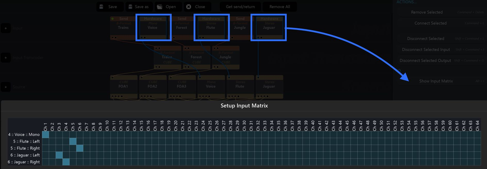

# 11.4 Multi Matrix Routing

When working with multiple hardware inputs, group a selection using _commandclick_ or _lasso drag_ before pressing the _Show Input Matrix_ action to construct a
grouped Matrix IO overview, which can provide a better understanding of the input channel routing in complex setups.

