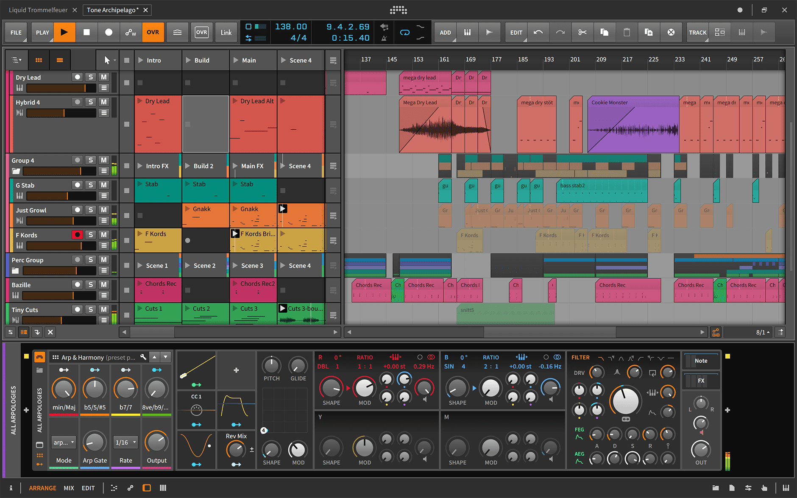
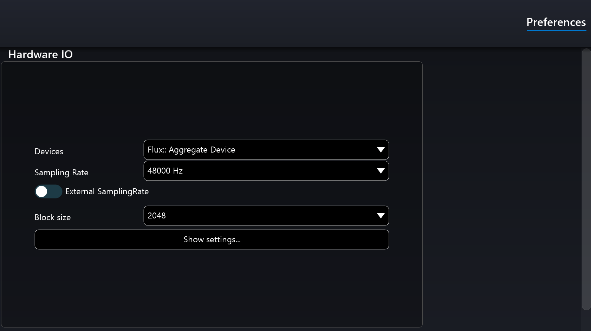
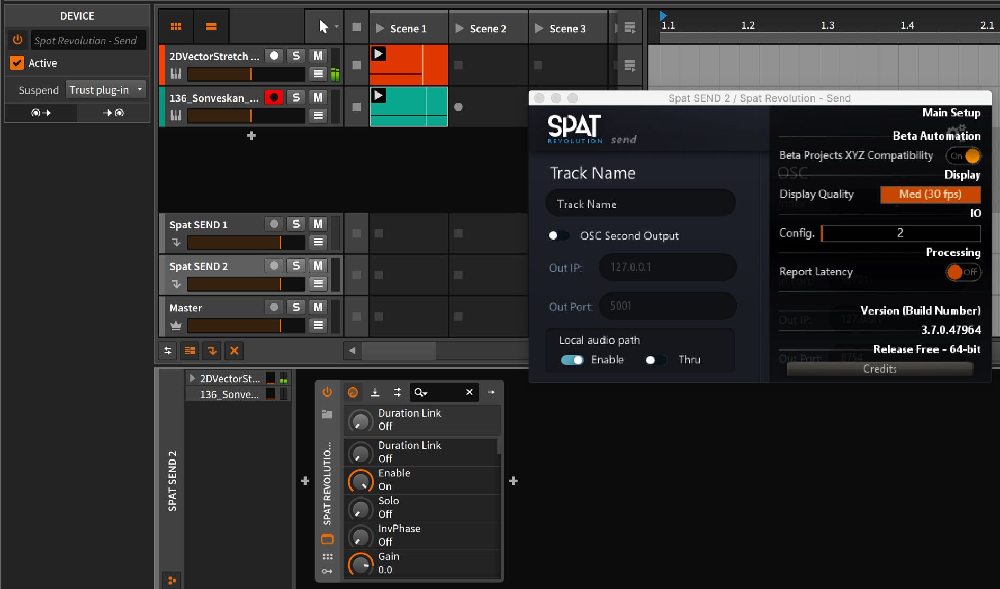
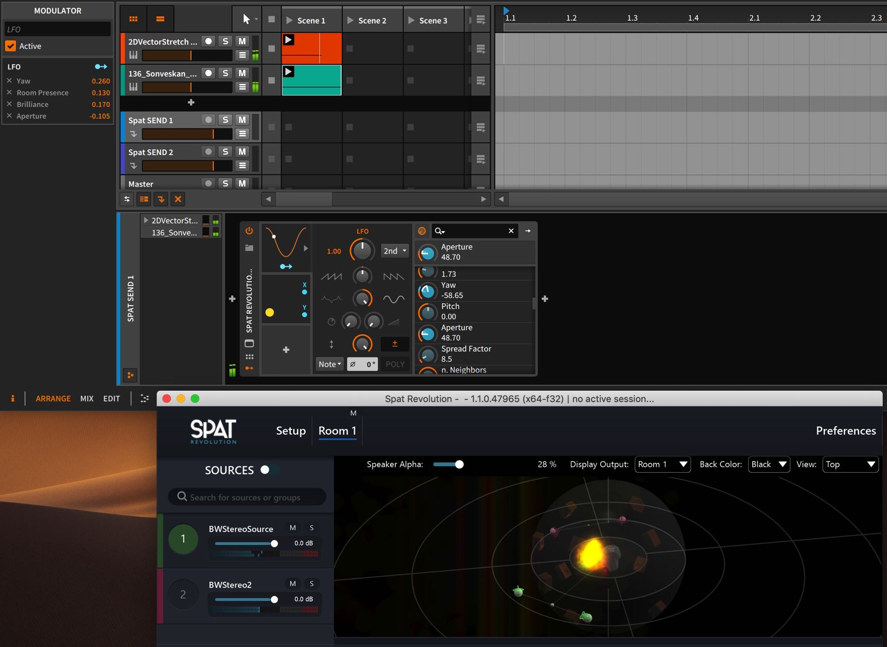

# 12.2 Bitwig Studio

Bitwig Studio is a DAW designed in Berlin with a live hands on philosophy to it.
Along with its highly animated and intuitive graphic interface, it offers well designed clip-based and timeline arrangement paradigms for composing. The Bitwig
designers have included a complete suite of powerful and great sounding native
effects and digital instruments, with many performance and modulation features for many users, its the parameter modulators and their well designed routing system that makes it compelling to create music and sound design in BitWig.

**Setting Up Sync in BitWig**

As described in section 7.4, when you are using the Local Audio path, the buffer
size and sample rate must be matched in both Spat Revolution and Bitwig Studio.
In Spat you do this in the preferences and in Bitwig you do in the audio engine settings. If they don't match at first, you _may_ need write the correct settings to the
preferences by quitting and restarting both applications to get the correct green
sync status between the apps.

**Setting Up Tracks in BitWig**

One good way to work with Bitwig and Spat together, is to set Bitwig tracks to output their audio to _Effect Track_ types - they are like Aux busses in other software you do that routing from an audio track output assignment settings.

**Setting Up Spat SEND in BitWig**

Put the Spat SEND plug-ins on individual _Effect Tracks_ , enable the local audio path
with **THRU** set to off, so all audio streams are rendered to output in Spat.

Like in all Local Path Audio workflows, you should see Spat SEND inputs appearing
in the Spat Environment Setup graph which relate directly to the plug-ins hosted in
the other software environment, reflecting their TrackName and channel count.

**Spat Source Automation in BitWig**

Now the fun starts - on the Bitwig Send tracks, which host the Spat SEND plugins,
you will see all the parameters of Spat sources available as dials. Use the Bitwig
( + ) to open the Device Parameter Modulators and assign the many and varied
modulation sources to control Azimuth, Distance or other Source Parameters.

**Setting Up Controllers in BitWig**

BitWig has comprehensive support for many popular MIDI controller surfaces.
These can be very easily mapped to Spat SEND parameters for hands on control of
virtual objects and rooms.

**Clearing Shared Memory**

Currently with Spat Revolution v1.1 some users have experienced an issue where
Spat SEND and RETURN plug-ins are not cleared from RAM after using certain
third-party hosts. BitWig is one of those.
If this happens, Spat SEND and RETURN modules will appear in the Spat setup
graph editor, when there is no host software running in the background. It can
cause problems, when a host with plugins is launched and more SEND and RETURN plug-ins appear to be doubled.

The workaround, if this is happening with your particular 3rd party software, is to
invoke a special debug action in the Spat setup editor. It is called _Clean Shared
Memory_. It is available by right-clicking anywhere in the background of the signal
graph editor. A pop-up menu will appear with various options and shortcuts. Scroll
to the bottom and choose _Help/Clean Shared Memory_

If this command is executed, Spat **and** the plug-in host will then need to be restarted.

