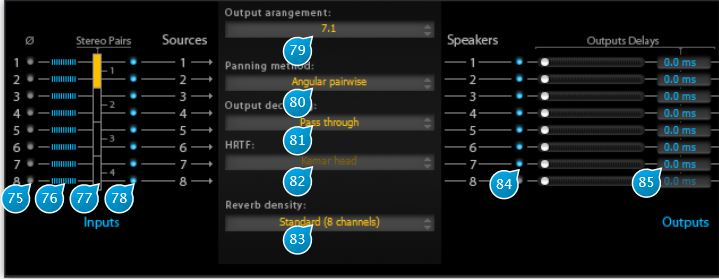

# Setup

## (75) Inv. Phase
This little button labelled "Ø" inverts the phase of the source, applying a 180° phase shift.

## (76) Input level meter
Gives an indication of the signal presence and peak level for the corresponding input source.

## (77) Stereo Pair
Enable two successive inputs to be treated as a stereo pair, displayed by a yellow vertical block overlapping the two inputs,
which make it possible to adjust their width in the stereo space.

## (78) Source On
Toggles wether the corresponding source is active or not (muted).

## (79) Output Arangement
Depending on the number of I/O channels you have selected in the setup menu, accessed via the cog icon between the
I/O meters, this drop-down menu allows you to select the desired output arrangement amongst a choice of stereo and a
variety of surround configurations, with or without a sub-woofer.  
This setting is provided so you can operate the Spat on a subset of your surround channels, should your project require
this.  
For example, when mixing a film soundtrack, it is mandatory that the center channel, which is reserved for voice material,
be left empty. The solution is to work with a so-called virtual center (equal energy in channels), disabling processing by the
Spat for the physical center channel.

## (80) Panning Method
Depending on the Output arrangement setting, choose the method to use for placement of the sources inside the audio
space.  
Possible choices are (some will be grayed out depending on your output configuration):

* Recursive
* Angular pairwise (default)
* Surround LRS
* Surround LRCS
* Binaural. Intended for stereo reproduction. Prefer transaural output encoding when loudspeakers are to be used.
* VBAP 2D (Vector Base Amplitude Panning).  
Allows for arbitrary placement of the speakers onto a horizontal plane.  
Refer to [http://www.acoustics.hut.fi/~ville/](http://www.acoustics.hut.fi/~ville/) for more information on this technique.
* VBAP 3D  
Same as above, but for a 3D speaker setup.
* DBAP (Distance-Based Amplitude Panning).  
Does not rely on any assumptions regarding speaker array or listener position, which is good for avoiding sweet spots.  
Refer to [http://jamoma.org/papers/icmc2009-dbap.pdf](http://jamoma.org/papers/icmc2009-dbap.pdf) for more information.
* B-Format 2D.  
A basic variant of Ambisonics. Amongst Ambisonics strong points are a good stability of the audio image with respect
to listener position, free speaker positioning, and independence towards the reproduction system used.
* B-Format 3D
* 2nd order Ambisonic 2D
* 2nd order Ambisonic 3D
* XY. Stereo only.
* M/S (Mid/Side). Stereo only.
* A-B. Stereo only.

## (81) Output Decoding
Spat can encode its output in the following currently supported formats

* Pass-trough, i.e. no encoding (default)
* Transaural. A method to reproduce binaural audio when using loudspeakers.
* B-Format 2D. A variant of Ambisonic encoding.
* B-Format 3D
* 2nd order Ambisonic 2D
* 2nd order Ambisonic 3D
* Surround LRS
* Surround LRCS

## (82) HRTF
When the Binaural panning method is chosen, one can select between a variety of head HRTF profiles, which stands for
Head-Related Transfer Function.  
In essence, a HRTF models the way a listener's head modifies an incoming sound beam, depending on its direction. One
can then measure and replicate the interaction of the head of a particular listener to recreate a sensation of 3D space.
> Please keep in mind this technique is only applicable to the stereo case. The default one available is the Kemar head, a
standard Manikin head. Some others are available (choose the HRTF library at install time). Their numbers refers to the
anonymous id of the listeners that have sampled their profile at IRCAM laboratories.

## (83) Reverb Density
Internally, spatial variations are computed using a kind of 2D-network of reverbs, and this setting toggles between an 8x8
(standard) or 16x16 size (high). The choice of which sounds best is left up to you, as this depends on the source material
at hand, although it must be emphasized that the high density consumes a little more CPU and that the color of the reverb
can be altered by this setting, particularly at some extreme parameter setting combinations.

## (84) Speaker On
Toggles the corresponding speaker output on and off, which can prove useful for checking purposes. In general it is 
advisable to use your DAW surround mixer capabilities instead, as these are global to your project.

## (85) Output Delays
An output delay, expressed in milliseconds, can be inserted just before output to the speaker, for example to compensate
for a non-standard speaker arrangement.
> Please note that if you move a speaker in the source view, the associated delay is automatically applied on the 
>corresponding output according to the speaker distance.
