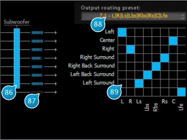

# Routing

## (86) Subwoofer On
Activates send of a speaker output to the subwoofer bus.

## (87) Output level meter
Output peak level meter.

## (88) Output routing preset
Gives quick access to commonly used output
mappings.

## (89) Output routing
Here you can map any Spat speaker output to a "physical" output. The plugin always ensures
there is a one-to-one correspondence between Spats internal outputs and the plugin output
channels, and remaps channels automatically when necessary.
