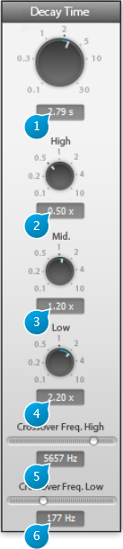

# Decay

## (1) Decay time

This is the duration of the reverberation 'tail' in seconds, in other words how long it takes for 
the reverberated sound to vanish away. In more technical terms, this is sometimes referred 
to as the RT60 factor, which is the time at which the response of the reverberation to an input 
signal goes below -60dB of attenuation.

Please bear in mind that the master decay and high/mid/low controls are interactive, which 
means that the same audible result can be attained with different settings. This is intentional, as this allows you to 
get to the result faster and in a manner suited to your personal habits.  
Generally speaking, it might be more convenient to adjust the master decay time using the 
resulting sound as a guideline, then fine tune using high and/or low decay controls and leave the mid decay at the 
default setting. On the other hand, if you specifically to concentrate on the mids, for example to create a 'hollow 
room' sound, it's easier to focus on the mid decay control, leaving hi and mid decay untouched.

## (2) Decay High
Adjusts relative decay time of high frequencies specifically. It is expressed as a ratio of the 
global decay time setting explained above. Default setting is 0.5, meaning the high frequencies decay faster than 
the main decay time. This behavior is quite typical of natural spaces, 
where high frequencies are easily absorbed (by furniture, carpet, etc...) before the lowest 
ones. Roughly speaking, for a given master decay time, increasing this ratio increases the 
sense of liveliness of the acoustic space, whereas decreasing it deadens it.

The correspondingly affected band frequencies are determined by the Crossover freq. high control setting.

## (3) Decay Mid
Adjusts relative decay time of medium frequencies specifically. Default setting is 1.

The mid range is where the human ear is most sensitive, and roughly corresponds to the frequency spectrum of the human voice.
The correspondingly affected band frequencies are comprised in between the Crossover freq. high and low control frequency values .

## (4) Decay Low
Adjusts relative decay time of low frequencies specifically. Default setting is 1.  
In most real acoustic spaces, low frequencies reverberate freely in the sense that wall materials barely affect the low-frequency response, except if specifically adapted materials have been employed such as bass-traps and anything that 
acts as a tuned resonator.
Generally room size and shape is what influences the low-frequency reverberation content the most, so one could say the 
default setting corresponds to a space with no low-frequency specific acoustic treatment.

The correspondingly affected band frequencies are determined by the Crossover freq. low control setting.

## (5) Crossover Freq High
Sets the frequency above which reverberation time is determined by the Decay high setting, expressed in Hertz(Hz).   
Default value: 5657 Hz

## (6) Crossover Freq Low
Sets the frequency below which reverberation time is determined by the Decay low setting, expressed in Hertz(Hz).   
Default 
value: 177 Hz
