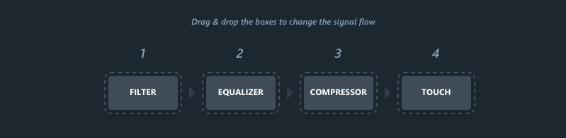

# General Settings

## Bypass

Global bypass, when pressed, the signal is routed directly from the inputs to the outputs.

Value Range : Enabled/Disabled

Default Value : Disabled

## Skin

The look of the EVO Channel user interface.

Value Range : Light/Dark

Default Value : Light

## Flow

Flow allow you to change the order of the modules in EVO Channel. Simply drag and drop a module to set your
perfect signal flow.

