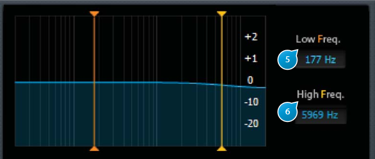

# Filter

This section sets the characteristics of the filter applied to the signal fed to the reverberation engine, affecting the overall
frequency response, if required.

## (5) Low Freq
Low-pass filter frequency cutoff of the corresponding filter section.  
Value can be quickly adjusted using the mouse by clicking and holding the value box or the yellow vertical bar on the
graphical frequency-response display, or exactly by clicking the value box and entering a value with the keyboard.

## (6) High Freq
High-pass filter frequency cutoff of the corresponding filter section.
