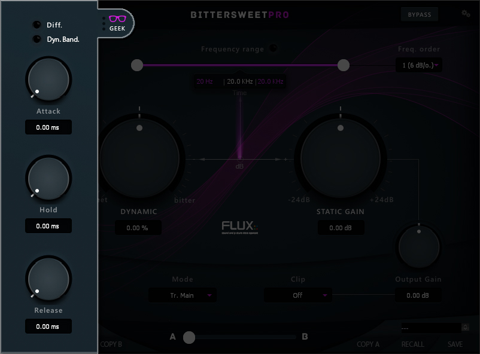

# Geek

Clicking the Geek glasses opens a window with an additional range of parameters providing extended control of the transient processing envelope.

|                                   |                      |
|              ---                  |          ---         |
|   [Diff. / Dyn. Band](#diff-dyn)  | [Hold](#hold)        |
|   [Attack](#attack)               | [Release](#release)  |

## Diff.

Diff. is a key listener for the Difference between input and output signal (at the final output, after the clipper).  

**Value Range:** Enabled/Disabled  
**Default Value:** Disabled  

## Dyn. Band

Dynamic Band adjusts the frequency bandwidth of the Peak, when a Peak is defined with the Dynamic Range filter, per default the it's static, which makes the bandwidth of the peak gain independent, and with Dynamic, the bandwidth becomes gain dependent.  

**Value Range:** Enabled/Disabled  
**Default Value:** Enabled  

## Attack

Adjusts the attack time for the transient processing envelope.  

**Value Range:** 0.00 ms / 200.00 ms  
**Default Value:** 0.00 ms  

## Hold

Adjusts the hold time for the transient processing envelope.  

**Value Range:** 0.00 ms / 200.00 ms  
**Default Value:** 0.00 ms  

## Release

Adjusts the release time for the transient processing envelope.  

**Value Range:** 0.00 ms / 500.00 ms  
**Default Value:** 0.00 ms  
