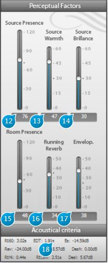

# Perceptual Factors 

This parameter group holds settings affecting the way the reverb sound is perceived by the listener. As explained 
previously, these are not simply names stuck onto any internal parameter dictated by the inner workings of the algorithm.

Instead, a true perceptually-oriented approach was used in the design of the plugin, where a test panel of listeners was 
presented with a test-set of sounds, constructed from several different variations of the reverb engine inner 
parameters. The listeners were then asked to rate each set onto a few different scales with perceptually and 
aesthetically meaningful names. Using principal components analysis (PCA) and optimization techniques, we then built 
an algorithm which reverses the process and automatically maps a given set of perceptual factor values to the many 
internal reverb engine parameters.

As a general guideline, we encourage you to learn the meaning of these parameters by carefully listening to the audible 
variations when adjusting them. We do provide a short explanation of each of them below, but training your
ears is really the best way to be able to use these in context.

## (12) Source Presence
Source presence refers to the prominence of the direct sound with respect 
to the reverberated sound. It is not just equivalent to a dry/wet ratio, and is
influenced by other settings such as distance, radius and drop-factor.

## (13) Source Warmth
Presence of the low frequency content part of the source.

## (14) Source Brillance
Presence of the high frequency content part of the source.

## (15) Room Presence
Prominence of the reverberation with respect to the source, or in other words,
how much the room sound dominates the overall sound.

## (16) Running Reverb
This parameter controls the amount of perceived reverb when feeding a continuous music message, where the overall
sound is a tight blend of the dry and wet signals and the reverb part cannot be mentally separated. It is linked to the early
reflections decay time.
> Note: this setting is distinct from 'reverberance' in the reverb tab.

## (17) Envelop.
Envelopment corresponds to the the perceived notion of how much the listener feels being surrounded by the ambient
sound. In a multichannel configuration, one could describe this as the feeling of being wrapped inside the imaginary
"sound sphere" that the listener pictures in his mind. It can also be described as the energy of the early room effect with
respect to direct sound.

## (18) Accoustical Criteria
This sub-panel displays the acoustical parameter values associated with the current settings. They are provided for the
more technically inclined users who already know how they can make use of them; you can safely ignore them otherwise.

> Please note this is an indicative feature only, as these settings can not directly be changed here.

* RT60 (Reverberation Time, in seconds): measure of reverberation decay time, namely the time taken by the reverb to
drop below -60dB of attenuation.
* EDT (Early Decay Time, in seconds): time to decay to -60dB, derived from a linear fit of the decay curve between 0 and
-10dB. It explains the very early evolution of a reverberation
* Es (dB): Early sound : power of direct sound and early room effect
* Rev (dB): Late sound : power of later reverberation
* ASW (Apparent Source Width, in dB).
* Desh (dB): Relative early sound at high frequencies
* RtHi (dB): Same as RT60, but in high frequency.
* RtLow (dB) Same as RT60, but in low frequency.
* Desl (dB):
