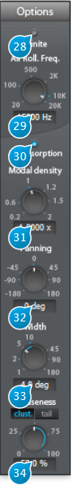

# Options

## (28) Infinite
When activated, the signal is recirculated indefinitely inside the reverberation engine.   
Best suited for special effects such as "deep-freezing" the signal, or if you're looking to create something a little less conventional than a fade-out for the end of your track.

## (29) Air Roll Freq
Roll-off frequency for the air absorption simulation via a low-pass filter. Signal content above this 
frequency vanishes faster.

## (30) Air Absorption
Simulates the frequency-dependent absorption of air, where high frequencies roll-off quicker than 
low-frequencies with respect to distance. You've most probably noticed this real-world phenomenon when you're far away from a concert venue and only able to hear the bass, and gradually start 
to hear the whole mix as you get closer.

## (31) Modal density
Scales the modal density with respect to the current setting, which is internal to the plug-in engine, 
and depends on other parameters such as reverberation time, etc.  
The modal density governs the frequency "smoothness" of the verb engine. Increasing this setting 
reduces the graininess of the reverberation. Adjust to taste, depending on the source material and 
desired result. 

## (32) Panning
Virtual source panning direction offset relative to input channels, in degrees.   
In mono-to-stereo mode, this acts as a standard pan control, adjusting L/R direction of the source.     
In a stereo-to-stereo channel configuration, this controls allows one to gradually remap the input   
channels to each virtual source. In N-to-N surround configuration, the input channels are gradually 
remapped to their closest neighbors, in a circular, carousel fashion.

## (33) Width
Panning width of the input channel - virtual source remapping described above.

## (34) Diffuseness
Determines the spatial width of the reverberated signal part, one could also say it changes the directional information 
of the reverberation, or the ability of the listener to locate the spatial origin of the this signal. In a real-life 
space, this would corresponding to how non-symmetric, irregular and complicated the shape of the room would be.  
When engaged, separate cluster and tail reverberation push-buttons determine which section is affected by the diffuseness parameter.
A zero setting equates to maximum localization while a 100-percent setting gives full diffuseness and no localization.
