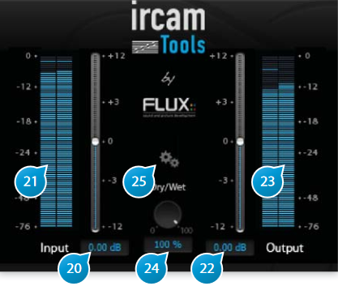

# Input Output Section

## (20) Input Gain
Adjusts the level of the signal fed to the plug-in, in dB increments.

## (21) Input level meter
Shows the current level of the input signal after applying input gain, in dB FS (deciBel Full Scale).

## (22) Output Gain
Used to trim the output signal and possibly avoid any overloading of the signal in the rest of the signal-chain.

## (23) Output level meter
Shows the current level of the input signal after applying output gain, in dB FS(deciBel Full Scale).

## (24) Dry/Wet
When used as insert effect, one can dial the right amount of “wet”, reverberated signal with respect to the “dry”, 
untreated input signal.  
The default 100-percent wet setting is mostly intended for the typical and preferred use in a send-effect configuration.

## (25) Setup
Advanced settings to override default behavior, typically when using hosts that do not conform to the standards.

### I/O
Override automatic track I/O specifications. VerbSession automatically adjusts its I/O configuration based on what the
hosts reports to the plugin. Some hosts such as Logic do not report this correctly or do not support asymmetric I/O
configurations In this case you have to do this manually and select amongst a number of choices of symmetric (N-to-
N) and asymmetric I/O (N to stereo).

### Options

These are best left at their default in most cases, but can be changed if required:

- Disable processing during bypass: stops processing completely during bypass. Allows to conserve CPU when
    using many instances and a lot of bypass on/off automation, such as fi lm or sound effects mixing. Default is
    off (enabled).
- Use Multi-Thread Automation: dedicate a separate thread for automation. Useful when heavy automation is
    present in the project to get rid of possible audio dropouts. Default is off (processing and automation share
    the same thread).
- Try to avoid latency as possible: minimize latency by employing minimal buffering, possibly at the expense of
    a little CPU overhead. Default is on.
- Report latency: report plugin latency, if any, to the host. Some hosts have difficulty coping with large latency
    values, in this case you can force the plugin to report zero, but you’ll have to manually compensate for this for
    tracks to remain synced. Default is on (report true latency).
