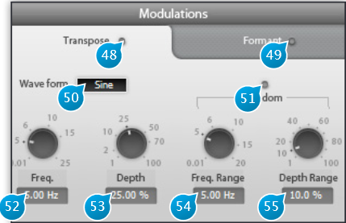

# Modulation

The Modulation panel allows for some additional modification of the material’s pitch and formants.

## (48) Transpose
Toggles pitch modulation on and off. This is akin to a LFO on an analog synthesizer, except with this you can
apply it to any kind of material. You can easily achieve wild results here and go overboard if you’re not careful, 
so it is advised to toggle this switch on an off quite often when doing adjustments to check you’re not
overdoing the effect.

## (49) Formant On/Off
Toggles formant modulation on an off.

## (50) Waveform
Three classic modulation waveforms are available:

* Sine
* Triangle
* Sawtooth

Deciding which is best is really a matter of taste and depends entirely on the incoming material.

## (51) Random
As the name implies, this adds some random amount to the modulation, which is great to make pitch variations seem less
obvious and predictable.

## (52) Freq.
Modulation Frequency in Hertz (Hz). The faster this setting, the faster the pitch and/or wobble. Can be used to make a
voice quaver at a few Hz, do whammy effects popular with electric guitar players, simulate an old warped record, but be
warned this can induce sea-sickness if used without restraint.

## (53) Depth
Depth of the modulation, in percent. Determines the amount of rise and fall of the pitch and/or formants.
Go for a value around or below the default 25% unless you’re looking for extreme results.

## (54) Freq. Range
When the Random button is on, this sets the extent of the random variations around the modulator base frequency.

## (55) Depth Range
Determines the amount of randomization applied. Setting this to 100% gives completely random modulation, going 
towards 0% makes the modulator resemble more to the original waveform.
