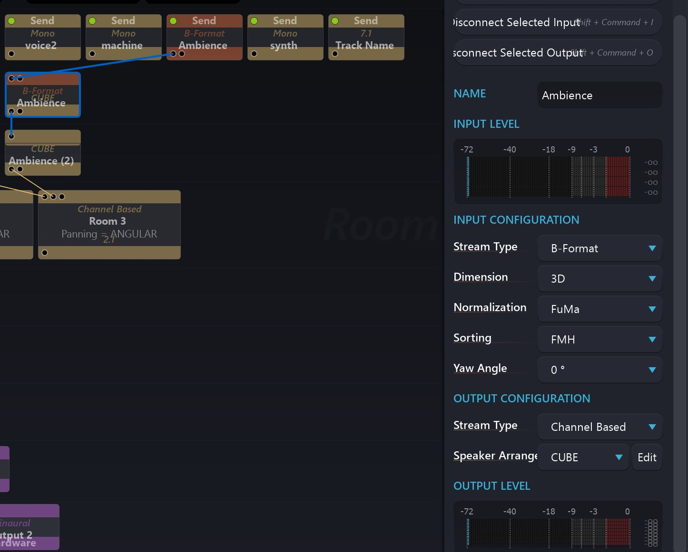

# 6.5 Input Transcoder

Spat Revolution can handle many different formats of multichannel audio through
out the signal flow, as we have been pointing out. As we approach the actual virtualisation of inputs into object based audio sources in the Spat _Virtual Rooms_ it may
be necessary to change from the original input format to another. You use the Input
Transcoder module and its parameters to do this.

Transcoder modules may modify the channel count of the stream passing through
it, depending on the format transfer being requested. For example, transcoding
from Ambisonic B-Format into a Channel Based 3D Cube involves a four channel
Ambisonic stream getting transcoded into an eight channel stream grouped and
treated as a specific speaker configuration.

