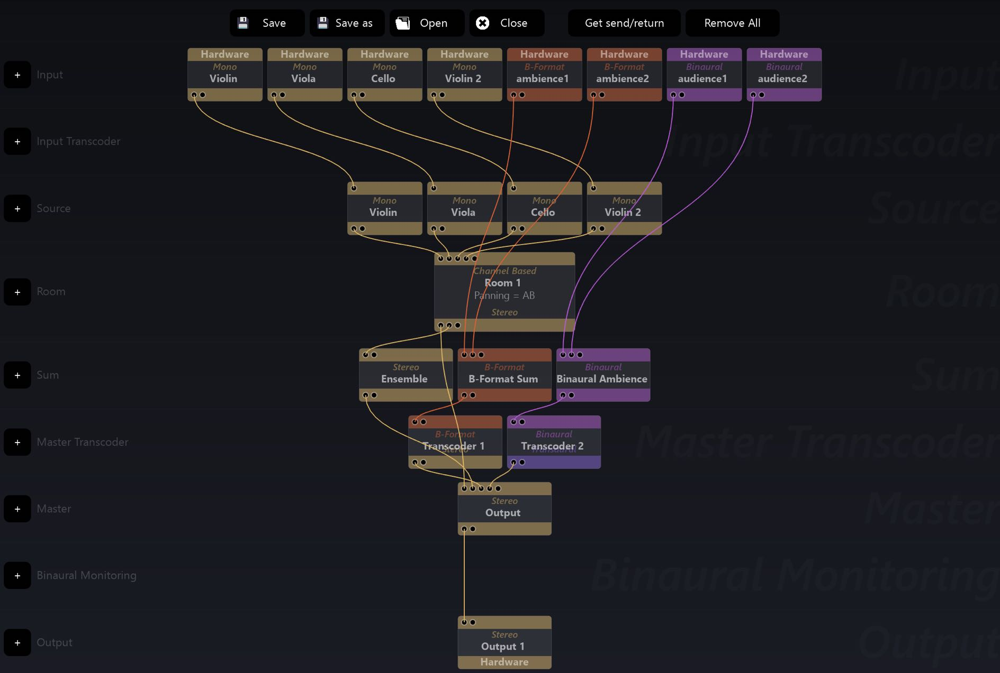

# 6.9 Master Section

The **Sum** row of modules is used to mix the output of two or more Rooms of the
same output configuration and in some contexts, to sum inputs directly without the
use of Room.

The **Sum** module can handle different input configurations. It will Sum channels
based on there channel names, so correct naming convention is important. Summing a 5.1 and 7.1 room together will output a 7.1 where their common L, C, R,
Left and Right Surround rear channels will have content summed from both rooms
the but Left and Right Back surround will be only from the 7.1 room.

> ★ Summing can also be done directly in Output Modules

The **Master Transcoder** row of modules offers an opportunity to consolidate the
various formats you might have been mixing into one (or more) formats for final
output routing by the **Output** modules. The same options and routing are available
as in the _Input Transcoder_ modules.

Finally, the two bottom rows in the _Envrionment Setup_ graph are the output modules for the entire project. The **Binaural Monitoring** row provides a way to decode
the whole scene to headphones only in binaural 3D (see section 5.1).

