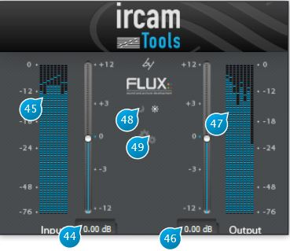

# Main Input - Output Section

## (44) Input Gain
Adjust the level of the signal fed to the plug-in, in
dB increments.

## (45) Input level meter
Shows the current level of the input signal after applying input gain, in dB FS (deciBel Full Scale).

## (46) Output Gain
Used to trim the output signal and possibly avoid
any overloading of the signal in the rest of the signal-chain.

## (47) Output level meter
Shows the current level of the input signal after applying output gain, in dB FS(deciBel Full Scale).

## (48) Day - Night
Toggles between two interface schemes, which, as the name implies, are best suited to high or low light environments
respectively. In a dimly-lit studio environment, switching to the nigthtime scheme with its darker color palette and lower
contrast will minimize eye-fatigue when doing long sessions.

## (49) Setting
Gives access to a sub-menu where you can either select the I/O configuration, namely the input channel count followed by
the output channel count, for hosts that support dynamic I/O configuration, or display the credits page.  
The exact I/O combinations available depend on your actual audio hardware and host configuration.
