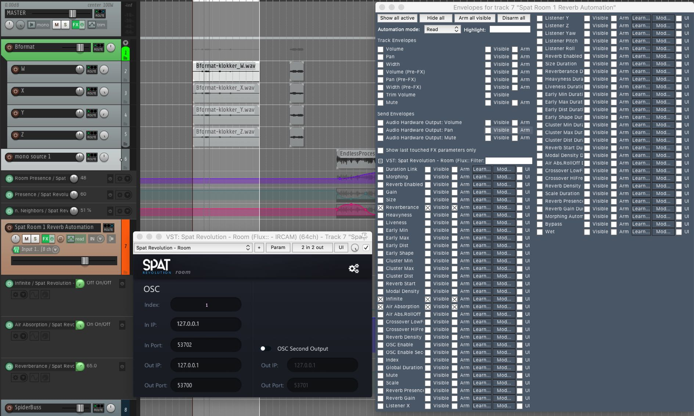

# 8.1 Reverb Parameters

Every variable of the Virtual Room reverberation can be directly edited through
the onscreen controls in realtime.

The reverb designer excels at creating static acoustic settings that will add all the
dimensionality and immersive depth to a virtual scene. But it also invites more creative reverberation ideas. Remember it works in 3D and interacts deeply with the
parametric design of all virtual objects that are expressed through it.

### **This is no ordinary reverb.**

The Spat Reverb is a true acoustic modelling multi-channel reverb, not just a socalled 'true stereo' reverb. Despite its internal complexity, the user is invited to
morph and modulate the characteristics of the virtual acoustics. To make this
process fluid and natural, the parameter controls have been carefully designed so
that they do not glitch. This invites continuous parametric modulation ideas, for designing out of this world reverberant spaces, in realtime.

> ★ _Every variable of each Virtual Room reverberation engine can be smoothly and
continuously controlled via DAW automation and OSC_

In order to automate settings from a DAW, you need to instantiate a _SPAT Room_
plug-in which will open access to all of the parameter controls (see sections 7.3
and 10).

