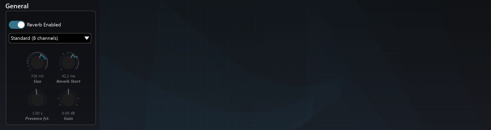

# 8.4 Reverb General

**Reverb Enabled**

Toggles the entire reverberation engine for the room.

**Reverb Density**

Internally, spatial variations are computed using a kind of 2D-network of reverbs,
and this setting toggles between an 8x8 (standard) or 16x16 size (high). The choice
of which sounds best is left up to you, as this depends on the source material at
hand, although it must be emphasised that the high density setting consumes a little more CPU and that the colour of the reverb can be altered by this setting, particularly at some extreme parameter setting combinations.

**Size**

This is a meta-parameter that takes care of varying several other parameters in order to quickly set the equivalent size of the virtual room, adjusting early, cluster and
tail reverb parameters to match the room characteristics.

**Reverb Start**

Reverb start sets the duration between the direct, dry source signal, and the first
late reflections, or start of the reverb tail. 

> Please note its value can never go below
that of the cluster minimum time as the reverb tail is fed with a signal derived from
the cluster section.

