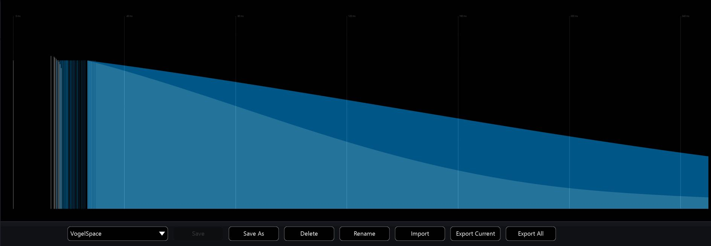

# 8.9 Reverb Design Presets

The Artificial Reverberation editor has its own preset management system, where
you can save pre-designed models into a user defined preset list or to disk.

This is useful for building up a collection of pre-designed reverberation spaces and
for designing models that might closely match the measurements of actual spaces
you already know.

