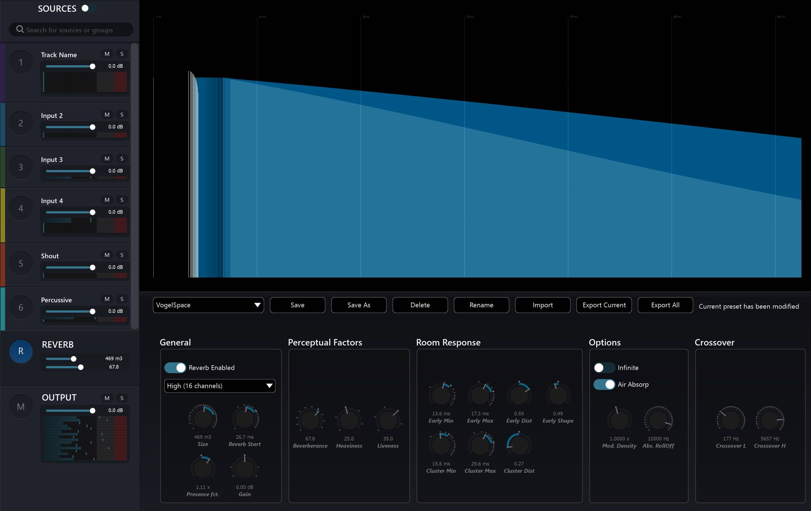

# 8. Artificial Reverberation

Each _Virtual Room_ in Spat can have its own artificial reverberation. Reverberation is
a very important element in the psycho-acoustic perception of localised sources
and immersive sound fields. The reverb processor in Spat is a multichannel algorithmic 3D reverb based on feedback delay networks. It also contains highly efficient multichannel real-time convolution without latency. The Spat reverberation
engine is designed to synthesise the experience of the virtual sources and the listener all being placed within the same virtual acoustic space. Virtual spaces can be
tuned, scaled and stored. Open the _Artificial Reverberation_ graphical editor by
clicking on the ( **R** ) index at the bottom of the list of Sources in the left side panel of
the Room, or entering a room directly from a tab in the top _global bar_.

Internally the Spat Revolution reverb engine models many technical acoustic parameters, but the user interface has been simplified a great deal, to make artificial
reverb design more straightforward and functional.

> ★ **Some Spat Reverb parameters control how the acoustics are _perceived_**

Alongside conventional tuning parameters which you might be familiar with, you
will also find perceptual parameters, such as _heaviness_ , _liveness_ and _presence_.

These _Perceptual Reverb_ parameters have been derived from the same IRCAM research 
experiments which were used to define the _Perceptual Factors_ of sources
such as _warmth, envelopment_ and _brilliance_. These can be found among the parameters 
for each virtual source (see section 9.3).

The Spat reverb designer can be used for a lot more than only simulating a
"normal" acoustic space. For example, you could try to design a totally unreal
space with continuously modulating acoustic properties or a space with infinite reverberation.

> ★ _Try switching the Infinite option for an immediately impressive immersive effect_

