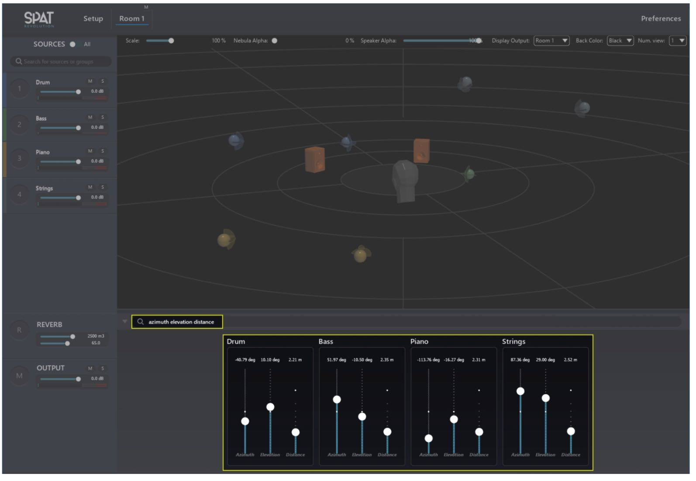

# 9.4 Smart Property Filter

This features allows you to display one or several parameters for all the sources
that are in the same Room. It is a useful feature for fast editing.
Type "azimuth elevation distance " in the filter box for example, and you will see
faders appear for only these properties, grouped for each of the sources as
demonstrated in the following screenshot.

