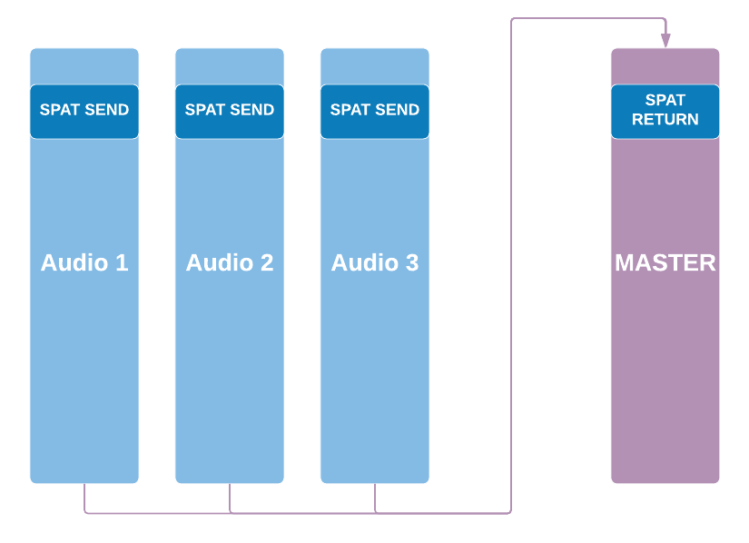
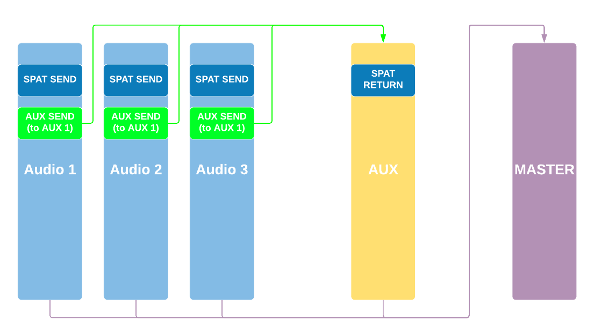
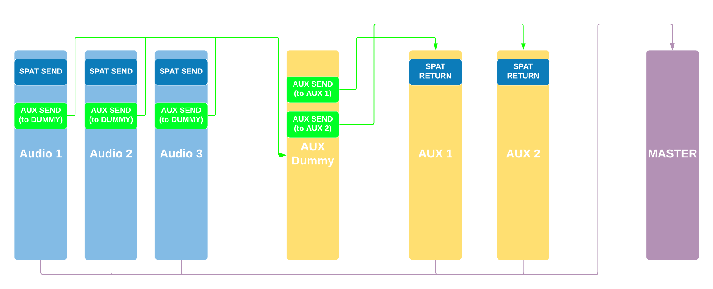
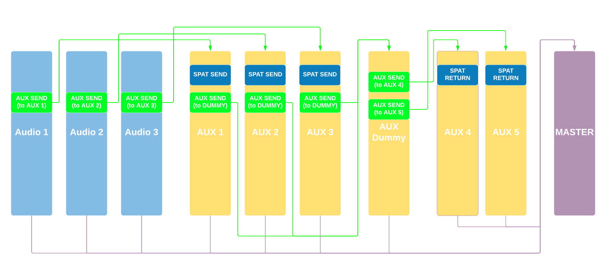

# Spat Send and Return DAW Troubleshooting

Sync issues encountered in Spat Revolution when using the Local Audio Path workflow, can often be fixed when following some guidelines for routing order inside
the DAW.

If you are using the Cockos REAPER DAW take a special look at the options that
need to set to avoid sync problems (section 12.1).

To work properly, the SEND plug-ins instances must be processed by the DAW
**before** the RETURN plug-in instances. To force the DAW to process this way, each
track with SEND plug-in inserted must be routed (directly or indirectly) to the tracks
hosting a RETURN plugin, using DAW internal routing.

Following are 4 examples of recommended practice with DAW routing, which
should cover the main use cases. If your problems persist even after implementing
these suggestions, don't hesitate to drop us a line at Flux support.

> **PLEASE NOTE:** _In the current version 1.1, the mixing of HARDWARE inputs and
LOCAL AUDIO PATH Send inputs may report a sync loss, as Spat Revolution cannot
guarantee correct sync in this scenario. Proceed with caution if this is unavoidable._

**Return on master track**

In simple projects, when having a single return plugin on master track, you should
not encounter any sync issue as long as each SEND track is routed to the master.

**Single RETURN on an AUX track**

Issues may happen when return is inserted on an AUX track. Make sure that each
SEND track is routed to the AUX track (RETURN track) using AUX send (see example below).

> ★ You might achieve the same by routing the track outputs to a buss

**Several RETURN on AUX tracks**

When you need several RETURN tracks (for example several rooms in Spat Revolution, and/or several outputs), you will have to route each SEND track to each RETURN track, using the same technique.

But it can quickly become complicated as the project grows. So, in the following
example, we added a 'dummy' track, that avoids using several AUX sends on the
'SEND 'tracks. It makes routing more clear and fast to setup on large projects.
The 'dummy' AUX track is routed to all the RETURN tracks (using AUX send)
Then, simply route all your SEND tracks to this 'dummy' track (using aux send).

**Independent Dry and Wet Signals**

In larger projects, when you need to keep both the dry signal and the Spat RETURN signals independent (when the mix requires to switch easily from one to the
other), add one AUX (pre-fader may be useful) per audio track to be sent to Spat,
and insert the send plugins on these AUX tracks.

This way, you keep the dry signal on the audio track's output.

**Clearing Shared Memory**

Some users have experienced an issue where Spat SEND and RETURN plug-ins are
not cleared from RAM when used with certain third-party hosts.
If this happens, Spat SEND and RETURN modules will appear in the Spat setup
graph editor, when there is no host software running in the background. It can
cause problems, when a host with plugins is launched and more SEND and RETURN plug-ins appear to be doubled.

The workaround, if this is happening with your particular 3rd party software, is to
invoke a special debug action in the Spat setup editor. It is called _Clean Shared
Memory_. It is available by right-clicking anywhere in the background of the signal
graph editor. A pop-up menu will appear with various options and shortcuts. Scroll
to the bottom and choose _Help/Clean Shared Memory_

If this command is executed, Spat and the plug-in host will then need to be restarted.

