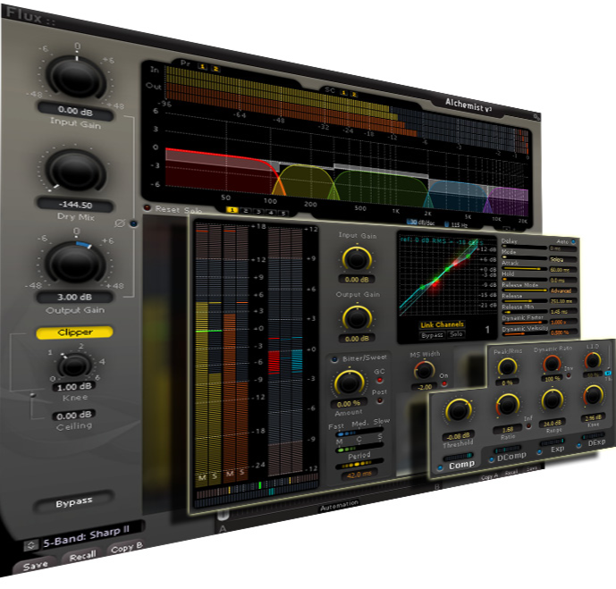
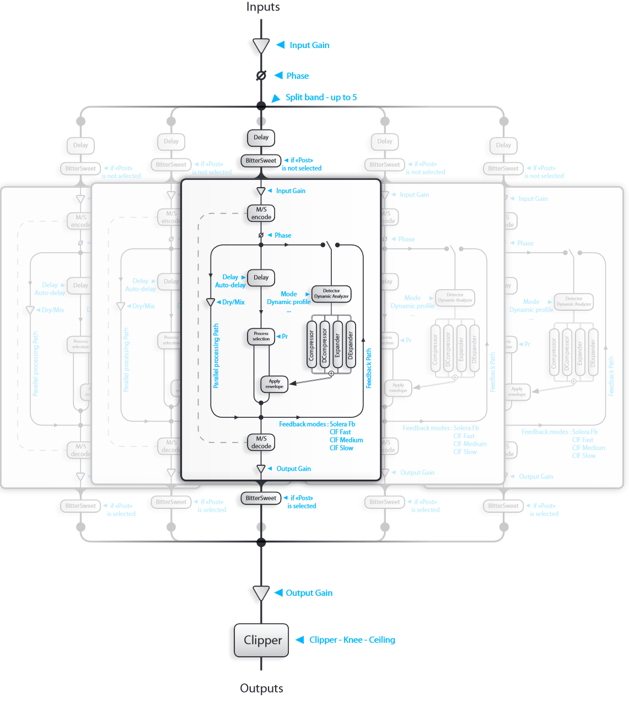

# Alchemist V3 - The Alchemist concept

[Product Page](https://www.flux.audio/project/alchemist-v3/) 
| [Shop Page](https://shop.flux.audio/en_US/products/alchemist)

At first, the wideband signal is split into frequency bands by a slope adjustable cross-over. Each band is individually 
processed for dynamic. For every frequency band, every dynamic processing section, the compressor, the de-
compressor, the expander and the de-expander features its own envelop generator including Dynamic Ratio, Peak
amount parameters, L.I.D. (Level independent Detector) and its threshold adjustment. For every frequency band, a
transient manager can be inserted pre or post dynamic processing. To achieve a total control on the audio signal, a
MS management is available on every frequency band.

Then all the frequency bands are summed to rebuild a wideband processed signal. A soft clipper featuring a threshold for soft knee, and a dry mix control are available.

Alchemist gathers in a single plug-in all the Flux science about filtering and dynamic processing.

