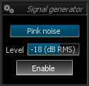
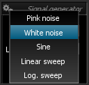

# Controls

Signal generator controls

# Type

Sets the <link type="document" target="Signal types">signal type</link> to generate.

# Level
<link type="document" target="Output">Output</link> level of the waveform, expressed in dB 
<link type="document" target="RMS">RMS</link>.

# Enable
Toggles signal generator output on and off.
