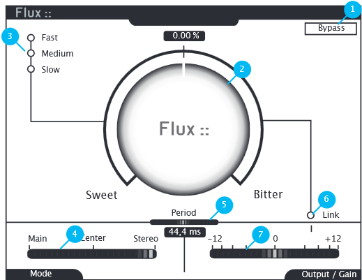

# BitterSweet V3 
[Product Page](https://www.flux.audio/project/bittersweet-v3/) 
| [Download](https://flux.audio/download)

## Bypass (1)

## Transient Amount (2)

On the Sweet side, transients are reduced. It usually decreases percussive instruments in the mix.

On the Bitter side, transients are magnified. It usually increases the percussive instruments in the mix.

## Transient Integration (3)

This selector allows to choose between 3 modes to process transients.

## Operation Modes (4)

Main processes using regular stereo signal scheme and it is the only available mode for multi-channels operations.

Center engages internal MS encoder and processes only the Mid channel. After processing the sound is decoded back to stereo.

This setting is very efficient for snare and kick drums.

Stereo engages internal MS encoder and processes only the Side channel. After processing the sound is decoded back to stereo.

This setting is very efficient for panned rythmic instruments.

## Period (5)

This control sets the range of the time window used to detect transients that will be processed.

## Link to Output Gain (6)

When engaged, the output gain is compensated depending of the transient amount to produce an almost unity gain.

## Output Gain (7)

It can’t be set when the Link to Output Gain button is engaged.