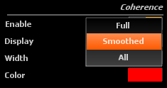

# Coherence

## Enable
Toggles the display of the coherence curve on or off. With multiple
snapshots, the display can rapidly become crowded, and in that case hiding the coherence curves will
improve legibility. In the general case however, we recommend leaving this enabled as coherence
represents important information which should not be overlooked.

## Use for curves transparency
Allow to use the coherence values to define <link type="document" target="Magnitude"> Magnitude</link> 
and <link type="document" target="Phase">Phase</link> curves transparency.

##<link type="document" target="Display">Display</link>

Toggles between one of three modes:

* Full : main unsmoothed coherence curve.
* Smoothed: smoothed coherence only.
* All: both.

Available coherence display modes

## Width
Size of the pen used to draw the coherence curve.

## Color

<link type="document" target="Color">Color</link>
of the pen used to draw the coherence curve.

