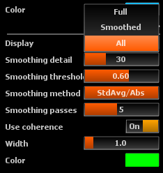
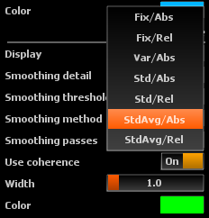

# Phase

## Phase curve specificities
You will notice the phase curve is generally very
sensitive to spurious noise and interference, and that in general it requires a bit of work on your
part in order to read and interpret it. Outside of the studio, in noisy places such as a live venue,
phase smoothing is almost always mandatory in order to get a readable curve. It is important to
understand that smoothing destroys information in order to achieve this, so you should always
double-check what you see on the smoothed curve against the original, raw data.

The algorithms employed here are specific to phase, and have more options than the regular smoothing
employed for spectrum magnitude, transfer function magnitude and coherence, in case you wish to
fine-tune their behavior.

## Display
Toggle between the various phase curve display modes:

* Full: raw phase only.
* Smoothed: smoothed phase only.
* All: both.

## Smoothing detail
Adjusts the overall level of detail that remains after
smoothing, in percent. Do not set this too low or you might miss out important information such as
phase shifts at critical frequencies such as those associated with loudspeaker crossover networks.

Values around 30 are appropriate in the general case.

## Smoothing threshold
Amount of relative local phase variation that is allowed to pass through. Raising this filters out local
phase curve detail, such as noise. Setting it to one suppresses all detail, whilst setting it to
zero leaves the curve untouched.

0.60 is a good starting point.

## Smoothing method
Please refer to <link type="document" target="Method">Phase smoothing methods</link>.

## Smoothing passes
Sets the number of smoothing algorithm iterations. You can apply the smoothing
process several times in order to get better results whilst still retaining local detail. Increasing
this value requires more CPU processing power, so it is advised to lower this value if you find your
computer cannot cope with the load. Default is 5.

## Smoothing Hide jumps
When enabled, the portion of the curve that corresponds to a phase rotation is not displayed.

## Smoothing uses coherence
When enabled, frequency regions of the phase curve with low
coherence are applied more smoothing. Conversely, regions with coherence close to one are applied
little or no smoothing.

Low-coherence regions are caused by low signal-to-noise ratio, multiple paths, etc. which cannot be
accurately described in terms of a simple gain and a phase shift anyway, so it makes sense to
suppress excess detail in these regions to improve the curve's general readability.

## Width
Size of the pen used to draw the phase curve.

## Color

<link type="document" target="Color">Color</link>
of the pen used to draw the phase curve.

# Method

Available phase smoothing algorithms.

The general principle is that for each curve pixel, the algorithm determines the amount of
smoothing applied in its neighboring region, based on a threshold determined from other pixels
in the region. The smoothing therefore adapts to the curve content, applying more smoothing in
noisy regions.

StdAvg/Abs was determined to be method giving the best results in the general case, and is set
as default. You might still want to experiment with other algorithms, especially if you have a
slow computer.

## Fix/Abs
This is the simplest and least CPU-intensive phase smoothing
algorithm. Smoothing uses surrounding pixels below an absolute threshold.

In practice, this means curve regions with large variations are applied stronger
smoothing.

## Fix/Rel
Same as above, using a relative threshold.

## Var/Abs
A variant of first algorithm.

## Std/Abs
The threshold is
determined from the pixels standard deviation, which is a statistical measure of data variation.

## Std/Rel
Same as above, using a relative threshold.

## StdAvg/Abs
Combination of above methods, using absolute threshold.

## StdAvg/Rel
Combination of above methods, using relative threshold.

!> Please keep in mind the smoothing process is purely a visual aid, and is not
intended to compensate for an inadequate measurement setup. In short: always rely on your ears
and scientific knowledge first !
