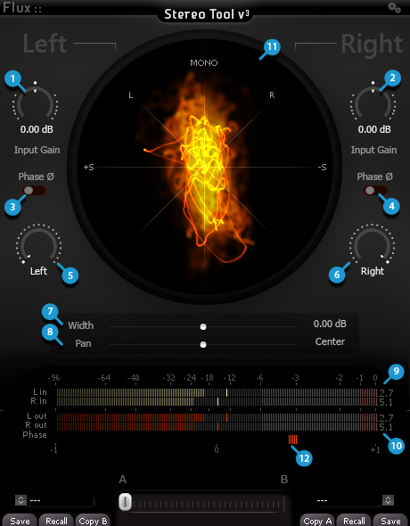
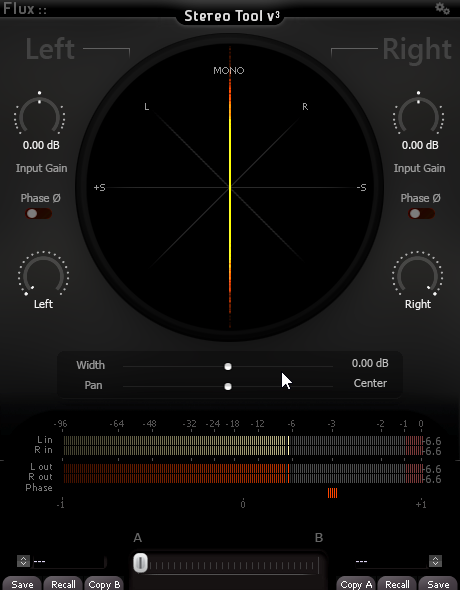
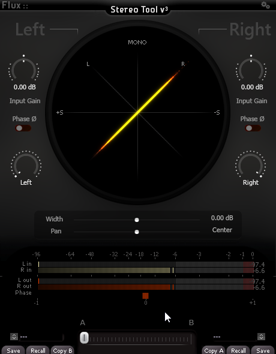
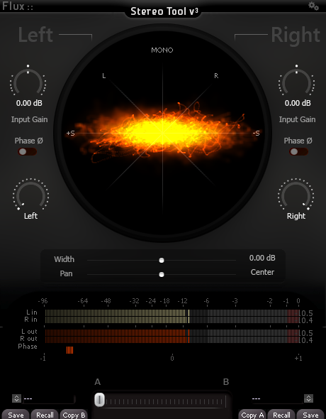
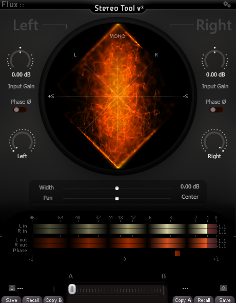

# Stereo Tool V3
Stereo Tool V3 is the perfect tool for correcting the stereophonic image of audio tracks and buses, both for mixing and mastering.
The integrated goniometer allows you to easily visualize and identify problems with your stereo signals.
 

 
 ## Channel adjustment parameters
 1 - Left channel input gain trim  
 2 - Right channel channel input gain trim  
 3 - Left channel phase invert  
 4 - Right channel phase invert  
 5 - Left channel pan pot  
 6 - Right channel pan pot  
 
 ## Stereo image adjustment parameters
 7 Stereo width
 Moving the slider to the right will enlarge the stereophonic image. To the left the image will be tightened.
   
 
 8 Stereo pan/rotation  
 Refocuses the stereo image
 
 ## Visualization and metering
 9 input peak meter  
 10 output peak meter  
 11-12 Goniometer  
 The goniometer gives informations about the phase between left and right channels. It also gives a visualisation of the stereo image width and panning.
 
 ## Goniometer interpretation
 ### Identify mono signals
 **Mono centered**  
 
 
 **Mono left panned**  
 
 
 **Mono right panned**  
 
 
 ### Identify issues in stereo signal
 
 **Out of phase**  

**phase issue/ too wide**  

**hyper-compressed signal**  
