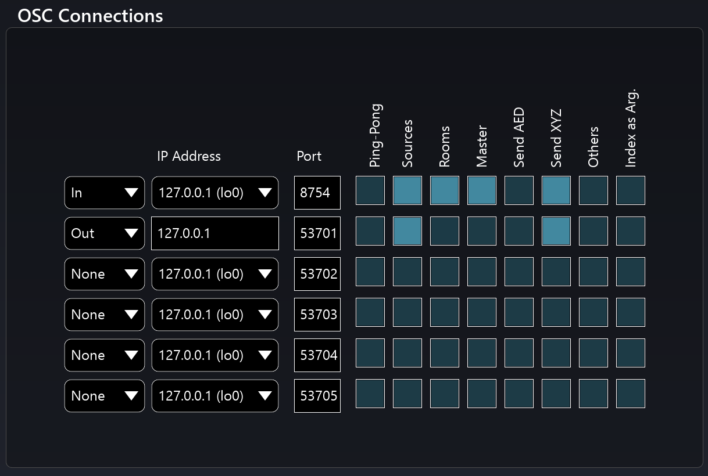

# 10.3 OSC Connections Matrix

There is a lot of flexibility in the OSC Connections matrix. You find it in the Spat
Preferences page. It is great for setting up networking, given the possibility of multiple network destination, source and message configurations.

The matrix switches serve as a way to filter some messages out, if you are not using
them or to alter the message format if you need to. For example, if you do not want
to automate Room and Master parameters, you can switch them off in the matrix.
These switches are useful for debugging and improving critical network performance.

The Matrix pull down menus identify a specified IP and Port to be either an **In** receiving data into Spat or an **Out** destination where Spat will broadcast control
messages generated from user interactions with parameter dials and source positional data.

For example when you want to record movements of a Source's parameters and
positional data, the Spat Send plug-in must be configured to be receiving on the
same IP and Port number specified in (only one) **Out** destination in the OSC connections matrix.

About the activation filters:

_Send ÆD_ - Activates Azimuth Elevation and Distance Polar co-ordinates

_Send XYZ_ - Activates XYZ Cartesian co-ordinates

_Sources_ - Activates all Source related automation

_Rooms_ - Activates Rooms and reverb related automation parameters, only sent
by Spat Room Plug in (not Spat Send)

_Master_ - Activates master gains, mutes and solo related automation

