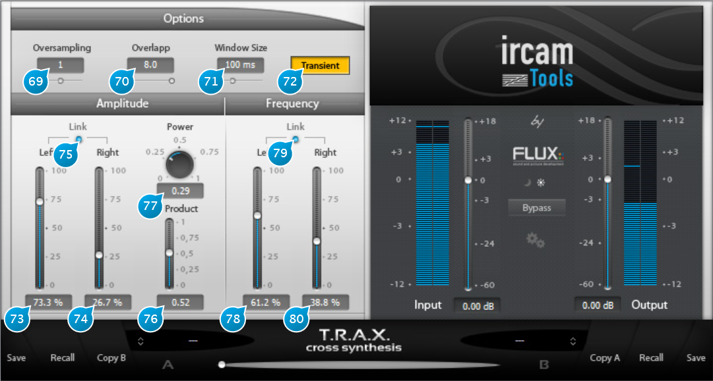

# Cross Synthesis

## (69) Oversampling
Adjusts the spectral domain oversampling factor, set to zero (none) by default. Increasing this setting can increase the
processing the processing quality, depending on the audio material, although at the expense of higher CPU usage, which
roughly doubles for every increment.

## (70) Overlapp
This determines how much extraction windows overlap during a given time-frame, or in other terms, how often the analysis
is updated for a given window size. Increasing this setting usually gives better results but also leads to more CPU resources
being used, as more data has to be analyzed. The default setting of 4 is a good trade-off, but you can increase provided you
have a reasonably fast machine and hear a noticeable difference.

## (71) Window Size
Window size determines the time-frame base used to extract time-localized data in time from the incoming material. It is
the most important parameter for all spectral domain signal transformations. It affects the capability of the algorithm to
detect and identify the individual components of the signal (sinusoids, noise and transients/onsets) and to treat them
independently. As general guidance, window size should be small for fast tempos and larger for slow music and at the
same time larger for spectrally dense or low pitched sounds and smaller for spectrally sparse or high pitched sounds. In
some cases, e.g. fast orchestral passages (that are spectrally dense and at the same time fast) the spectral and temporal
characteristics ask for different windows sizes. In these cases finding the optimal window size requires some 
experimentation with different settings.

## (72) Transient
For the T.R.A.X. Cross Synthesis plug-in, toggles transient processing on and off.

## Amplitude:
This sub-panel determines how the output amplitude is affected by the left and right channels.

### (73) Amplitude Left
Sets the percentage of the left channel used to derive the output amplitude.

### (74) Amplitude Right
Sets the percentage of the right channel used to derive the output amplitude.

### (75) Amplitude Link
Links left and right channel amplitude controls in inverse fashion, which gives a kind of panning control.

### (76) Product
Determines the amount of the product of the amplitudes of both channels that will be mixed into the output amplitude.

### (77) Power
Exponent of the power law that is applied to the amplitude product. Default value of 0.5 corresponds to a square root,
which produces the geometric mean of the amplitudes of both channels and is the setting that best preserves the signal
power of the product amplitude spectrum when compared to the original input amplitude spectra. Smaller values of the
power control will equalize low and high amplitude components while larger values will amplify the differences in the
amplitude spectrum (amplifying spectral components in locations that are strong in both input spectra and suppressing
spectral components that are weak in either or both input spectra.

## Frequency :

This sub-panel determines the frequency content of the output with respect to the inputs.

### (78) Frequency Left
Sets the percentage of the left channel used to derive the output frequency spectrum.

### (79) Frequency Link
Controls the gain applied to the dynamic processing input. This setting may affect the dynamics signal detection.

### (80) Frequency Right
Sets the percentage of the right channel used to derive the output frequency spectrum.
