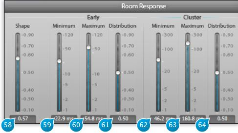

# Room Response

## (58) Early Shape
Governs the amplitude rise or fall of early reflections. The default setting of 0.5 corresponds
to early reflections all having the same level. This mimics an acoustical space where reflective surfaces are all 
located at roughly the same distance to the listener. Below 0.5 early reflections decay with time, above 0.5 they rise 
with time.

Early reflections of decreasing level would be typical of a space where most of the reflective surfaces are grouped at a
range closest to the listener.

## (59) Early Minimum
Early reflections minimum time, i.e. the time at which the early reflections start to appear, in milliseconds. This is the
analogous of the ubiquitous "pre-delay" setting found on most reverberation processors. It represent the time between
the direct sound and the first early reflection.

## (60) Early Maximum
Early reflections maximum time, i.e. the time at which these cease to appear.

## (61) Early Distribution
Early reflections distribution. Determines the way early reflections are scattered in time, inside the Early Min. / Early Max.
interval. The default setting of 0.5 corresponds to regularly spaced reflections, above these are more grouped towards the
Early Max. value, and vice-versa.

## (62) Cluster Minimum
See 59, Early Min.  
> Please keep in mind the cluster is fed with the input of the early reflections processor section, as is shown accordingly on
the display.

## (63) Cluster Maximum
See 60, Early Max.

## (64) Cluster Distribution
See 61, Early Distribution.
