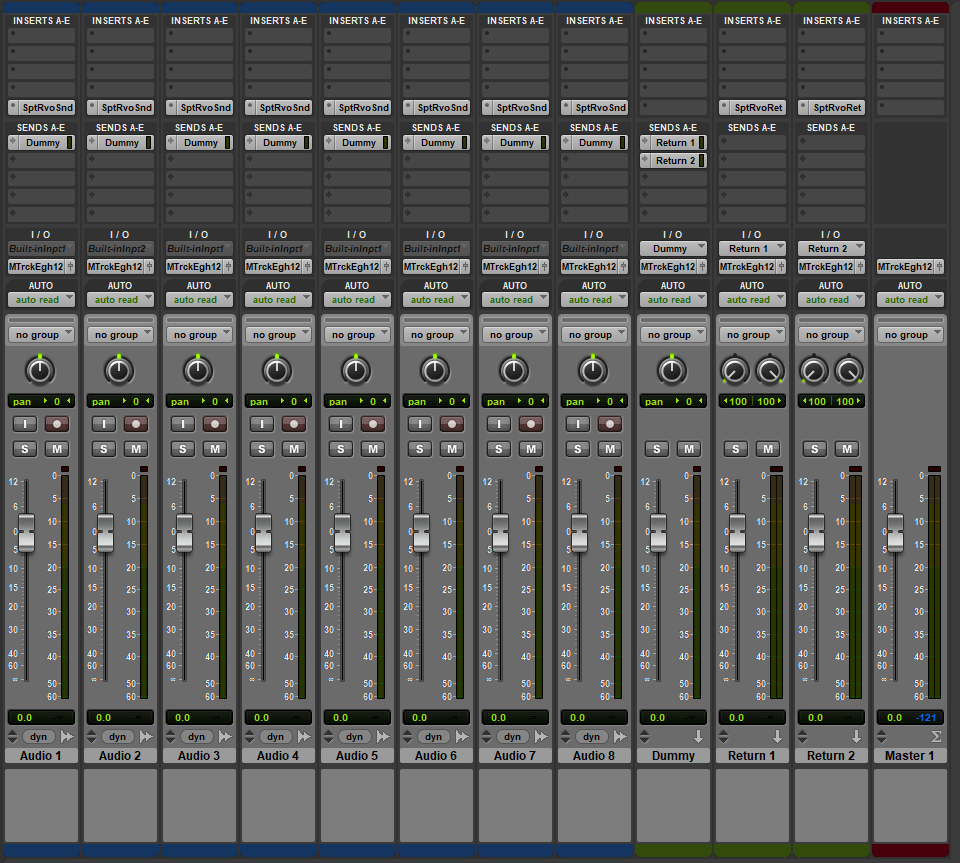
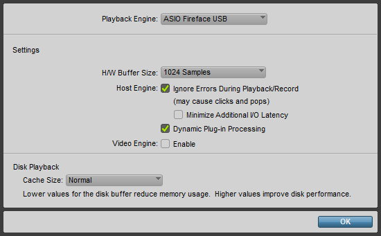
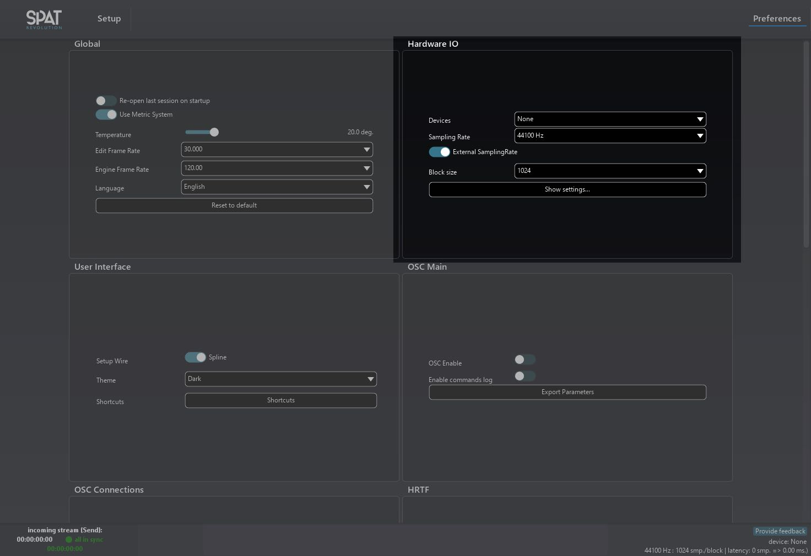
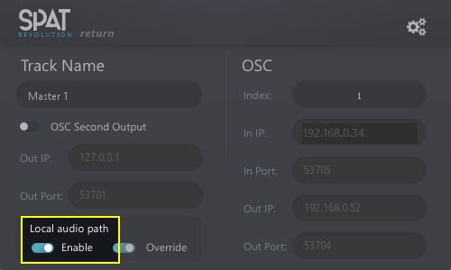
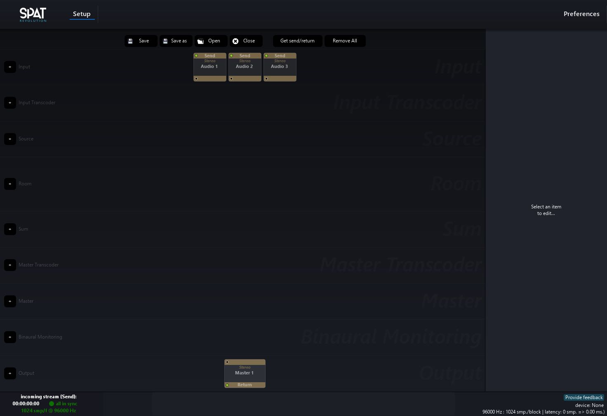
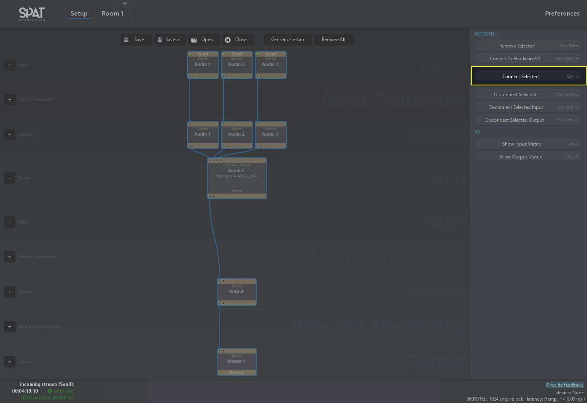
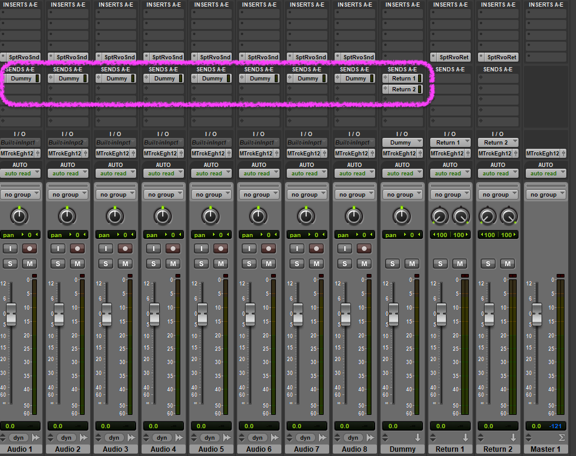
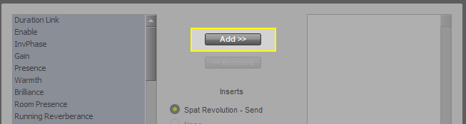
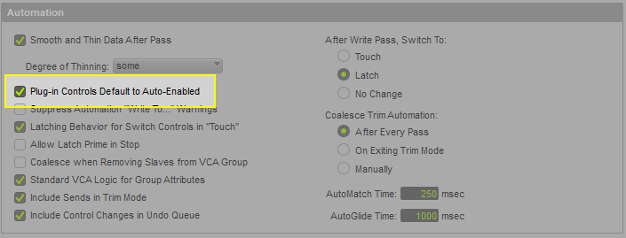

# 12.3 ProTools

Spat Revolution can use the AAX version of its plug-in suite to establish connection
between Avid ProTools and the Spat Revolution environment. Here is a rough
guide to getting things running smoothly when using the local audio path and ProTools.



**Setting Up Sync in ProTools**

We have found that sync issues are best avoided when the playback engine buffer
size is set to 1024 samples, in both Protools and Spat Revolution.
In Protools, go to _Setup/Playback Engine_ then set H/W Buffer Size to 1024 samples.



In Spat, go to _Preferences/Hardware IO_ , then set :

```
Device : None
External Sampling Rate : Enabled
Block Size: 1024
```



Please note that you _may_ have to close and restart Spat to ensure that everything is
properly saved and applied.


**Setting Up Tracks in ProTools**

As a first step, please give a look at Appendix B. It describes the best practices for
routing in most DAWs to avoid sync issues with Spat Revolution.

To setup a Protools session to work with Spat Revolution using the Local Audio Path
mode, is simple. Just add Send and Return plugins and enable the 'Local Audio
Path' option for each.

Once you flick on the _Enable_ switch, matching Send inputs should show up at the
top of the Spat Revolution setup page, and Return outputs at the bottom of the
graph.



!> Routes to the Plug Ins will appear in the Signal Flow Graph only
when Enable is switched on



Select all the objects in the 'empty' signal graph using a drag select or Commandclick selection, then choose the 'connect selected' action. A default graph will be
completed automatically.



Now you should be able to send and receive the spatialised audio streams via ProTools mixer channel strips.



Please note the use of a 'Dummy' bus track, to make the audio tracks easier to setup. The idea is that you route audio tracks to the 'Dummy' bus using aux send and
insert a 'send' plugin with local audio path option enabled.

This 'Dummy' bus track has 2 aux send to route the signal to both the 'return'
tracks. Simply put an audio file in the send tracks and connect the input and outputs objects in Spat Revolution.


**Spat Source Automation in ProTools**

To automate variable parameters in the Spat engine from ProTools automation
lanes, it is necessary to activate the parameters for each plugin instance first.



To do this one by one could be laborious. Save some time and clicking by enabling
the ' _Default to Auto-Enabled_ ' option in ProTools. When inserting a plugin, all its parameters will then be available for automation automatically.



