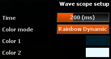
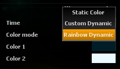

# Setup

## Time
time window in millisecond

## Color Mode

### Static

<link type="document" target="Display">Display</link>
the waves using 1 unique static color.

### Custom Dynamic

<link type="document" target="Display">Display</link>
the waves according to the transient using a 2 user defined colors gradient.

### Rainbow Dynamic

<link type="document" target="Display">Display</link>
the waves according to the transient using a rainbow colors gradient.

