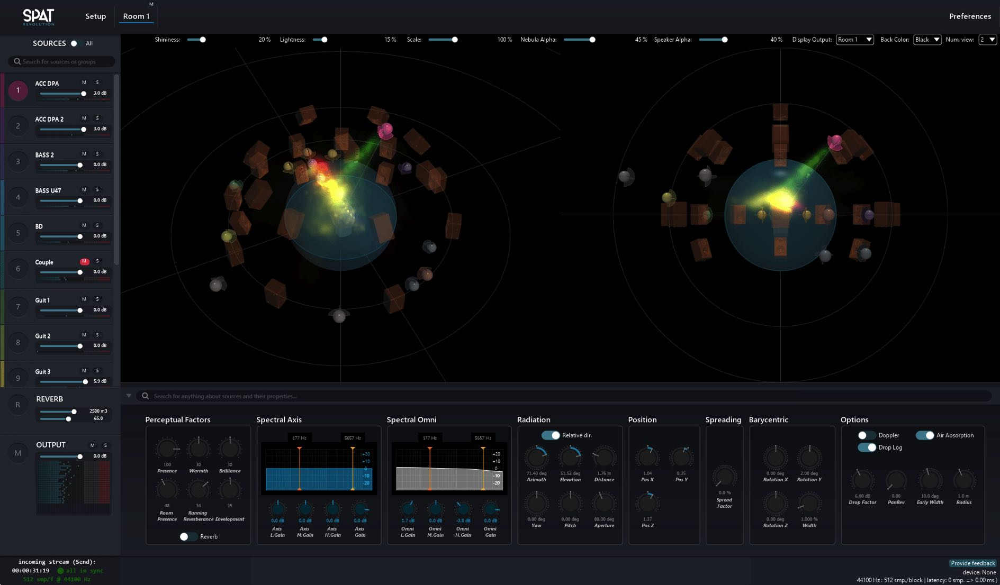
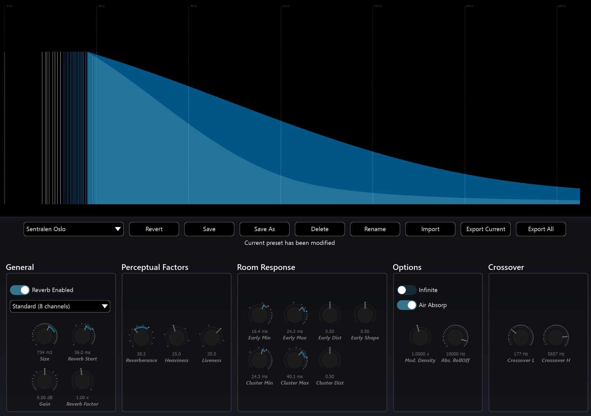

# 1. Welcome to Spat Revolution

First of all, thank you for purchasing _Spat Revolution_. We hope it will provide you
with new levels of productivity, creativity and experience in sound design. Our goal
was to deliver the most comprehensive real-time spatial audio renderer ever designed, and to make the whole process of spatialised audio production powerful
and intuitive for beginners and professionals alike. Our real-time audio environment provides easy access to some of the most advanced spatialisation algorithms
currently available, at the very best sound quality currently possible.

_'Spat'_ is short for _Spatialisateur_ in French. It is a real-time audio library that allows
composers, sound artists, performers and sound engineers to control the localisation of sound sources in virtual and real 3D auditory spaces.

_Spat Revolution_ wraps the 'Spat' processing library in a luxurious and characteristic
graphic environment to help visualise many aspects of a spatial audio composition
in realtime. This graphic interface allows sound mixes to be composed as interactive spatial models existing in _Virtual Room_. High definition graphic displays like
the unique _Nebula_ analyser for example, can simulate how sound sources localise
their direct sound over different speaker setups.

In addition, Spat contains a powerful multichannel reverberation engine which can
be applied to design and add a sense of auditory space in studio mixes and realtime on location.

> Artificial Reverberation Editor

> **Spat Revolution maintains the highest audio quality**
>
> **throughout the entire signal flow**

