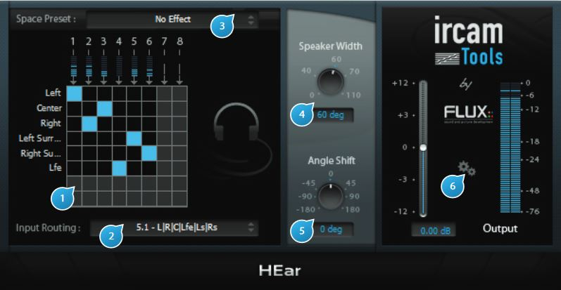

# Controls

## (1) Routing Matrix

The routing matrix gives an overview of the mapping between the plugin's inputs from the DAW track to the virtual speaker
internal outputs. The virtual speaker outputs are down-mixed to stereo using a virtual speaker processing algorithm.

Please take note that the plugin's output to the DAW track itself is always stereo as the binaural processing is intended
exclusively for use with headphones.

The meters above the fi rst row indicate the source levels of individual input channels.

User controls
 

## (2) Speaker Mode

Specifies which virtual speaker configuration should be emulated.
Available modes depend on the configuration of the track the plugin is inserted into, and comprise of one or more of the
following:

- 5.0
- 5.1
- 7.1
- 8.0

## (3) Space Preset

Selects between different spaces with subtly different colorations (Preset 1..3) or completely neutral (No Effect)

## (4) Speaker Width

Controls the width between virtual speakers, expressed in degrees. The default is 60°, which corresponds to the 
recommended setting. This allows to narrow or broaden the stereo image.

## (5) Angle Shift

Controls the angle between the listener and the centre of the virtual speakers. The default is 0°, which corresponds to the
ideal listener position, giving a balanced image between channels.

## (6) Setup Menu

Advanced settings to override default behavior, typically when using hosts that do not conform to the standards.

### I/O

Override automatic track I/O specifications. HEar automatically adjusts its I/O configuration based on what the hosts
reports to the plugin. Some hosts such as Logic do not report this correctly or do not support asymmetric I/O 
configurations In this case you have to do this manually and select amongst a number of choices of symmetric (N-to-N) 
and asymmetric I/O (N to stereo).
 
### Options
 
These are best left at their default in most cases, but can be changed if required:
 
- Disable processing during bypass: stops processing completely during bypass. Allows to conserve CPU when
    using many instances and a lot of bypass on/off automation, such as film or sound effects mixing. Default is
    off (enabled).
- Use Multi-Thread Automation: dedicate a separate thread for automation. Useful when heavy automation is
    present in the project to get rid of possible audio dropouts. Default is off (processing and automation share
    the same thread).
- Try to avoid latency as possible: minimize latency by employing minimal buffering, possibly at the expense of
    a little CPU overhead. Default is on.
- Report latency: report plugin latency, if any, to the host. Some hosts have difficulty coping with large latency
    values, in this case you can force the plugin to report zero, but you'll have to manually compensate for this for
    tracks to remain synced. Default is on (report true latency).

