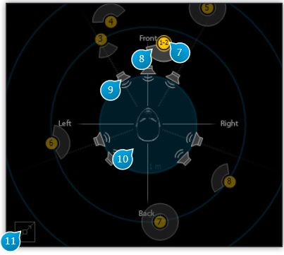

# Display

This sub-panel displays a to-scale representation of the sources and speakers spatial localization settings, projected 
onto a 2D flat space.  
Assessing the location of a point is easy with the aid of the circular "grid" scale drawn onto the background as a 
guide, using a polar coordinate system.

The spherical coordinate system used here requires the following three parameters to describe the position of a point in 
3D-space, relative to the listener:

* Distance to the centre reference point, expressed in meters on a logarithmic scale
* Azimuth, or the angle with respect to a vertical line (zero is in front), in degrees.
* Elevation, in degrees.

Also, the source orientation is available as yaw an pitch.

Zooming in and out of the display is achieved using the scroll wheel present on most available mice.

Note that when the current source is not at abase plane (z-axis), a little display appears on the right, explaining this 
z-elevation for this 2D view context.

## (7) Source
A source represented by a yellow disk with its corresponding number. Clicking on this disk makes this source active and
highlighted, allowing it to be moved and edited.

Alt-clicking (MacOS: Alt/option key) and dragging on the yellow source disk changes its aperture (See 21)  
Ctrl-clicking (MacOS: Apple/command key) and dragging on the yellow source disk changes its yaw (See 20)

When two sources are associated in a stereo pair, this yellow disc is surrounded by a yellow circle.

## (8) Aperture
Represents spatial width and direction of the source signal part, which determines the preferred directivity. See 25.

## (9) Speaker
Speaker location and direction. Each speaker can individually be moved by clicking and dragging, and reset to its default
position with a right click.  
Speakers can also be hidden by right-clicking anywhere in an empty space.  
Please note the number and characteristics speakers are respectively adjusted in the Setup sub-menu and tab

## (10) Radius
Represents the the no-drop zone (See 40, Drop) as a transparent blue disk of corresponding radius.

## (11) Full Size Display
Toggles between standard display as a sub-panel and a full-size display, which is more convenient when very precise 
settings are need, or when doing intensive source localization automation for example.
