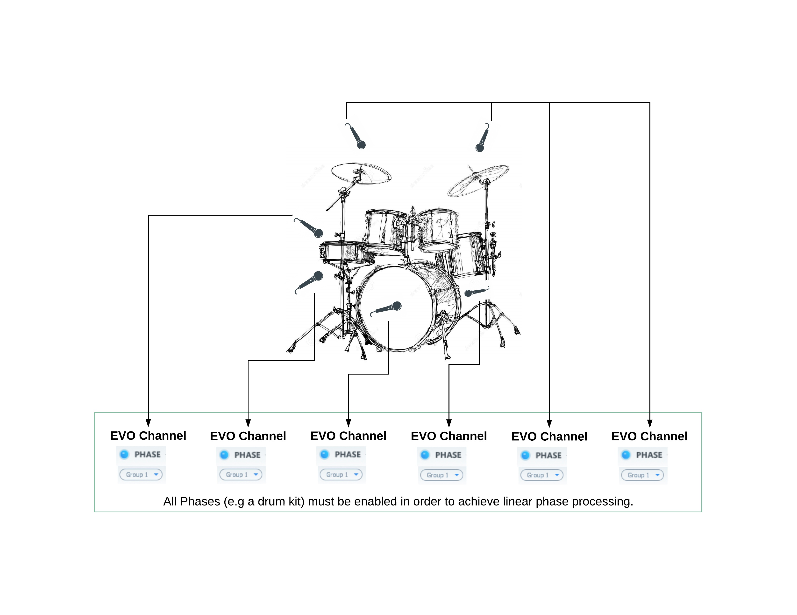
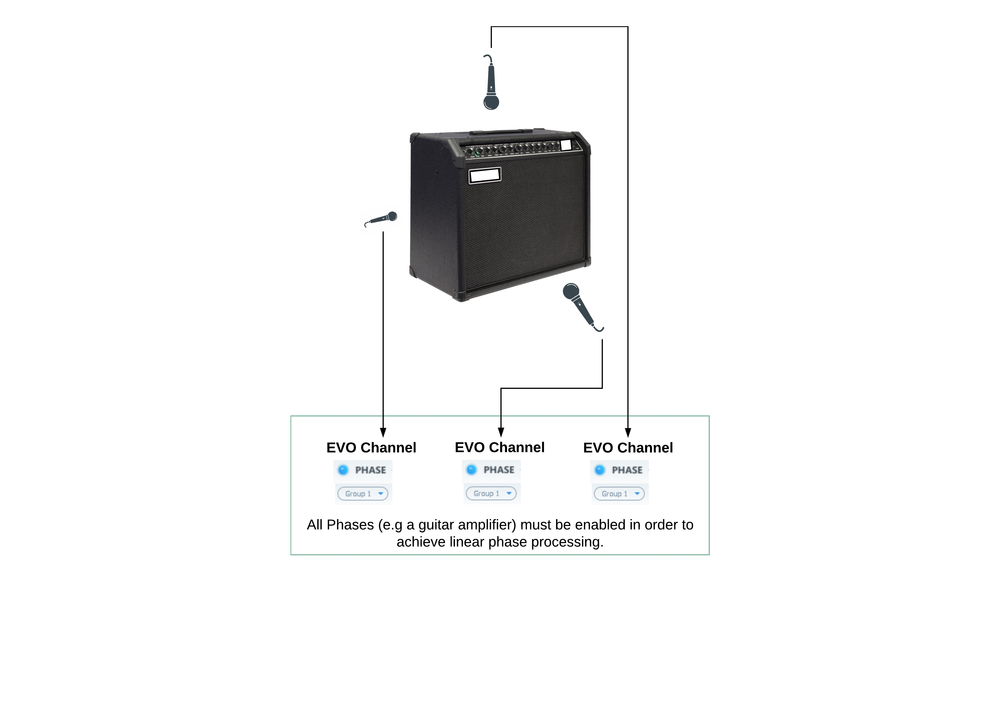

# Module Settings

## Drive

In EVO In a signal Drive is available for restoring and maintaining the vitality of the sound.

The EVO IN Drive adds a soft saturation to attain roundness and warmth, restoring and maintaining the vitality
of the sound, by generating harmonics important for the constancy of the sound without any audible distortion,
on all types of sounds and instruments.

Value Range : 0% / 100%

Default Value : 0%

## Phase

One of the most crucial parameters to take into account; Phase, or “The art of using multiple microphones on
one and the same sound source”, a classic example is when setting up the sound for a drumkit.

Controlling the Phase of microphones is universal and relevant both for studio and live use. In EVO In an
Arbitrary and Linear Phase Rotation throughout the spectrum is provided, to accomplish the same natural thing
as when physically moving a microphone, of course without adding any latency.

The phase must be enabled for all the drum tracks. Then set the same group number for all these tracks. It
allows to enable and disable the phase for all the drums in one click (simply switch on/off for the phase in one of
the tracks).

### Phase Switch

The Phase is the result of Flux:: proprietary research, this unique algorithm allows linear phase correction with
zero latency.

Activate the phase module on all of the tracks that were recorded at the same time and in the same room (multi-
microphones tracking or live recording in exemple), and then use the slider on the different tracks until you get
full control over the phase and everything sounds correct.

When enabled, the phase correction is turned on.

Value Range : Enabled/Disabled

Default Value : Disabled

### Phase Group

Add an EVO In instance to a Phase Group. You can add an instance of EVO In to a group, all the members of
the same group can then have their Phase enabled or disabled at one and the same time. To do so, add the
instance to a group by selecting the group number for the desired group. Now when you then turn the phase
switch on or off in any of the instances in the group, this will affect all instances that are members of the same
group.

Value Range : None/Group number

Number of groups : 8 groups

Default Value : Disabled

### Phase Correction

Set the shift value used to correct the phase.

Value Range : -180° / 180°

Default Value : 0°

### Polarity Invert

When enabled, polarity inversion is applied to the signal.

Value Range : Enabled / Disabled

Default Value : Disabled

