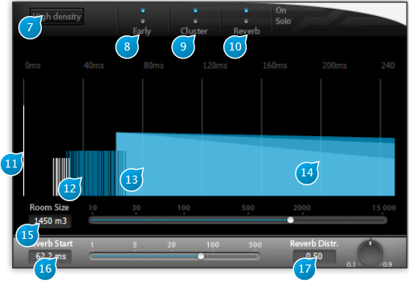

# Time Structure Display

## (7) High density
Toggles between standard and high density reverberation engine.   
High density gives better quality at the expense of a little more CPU consumption, by increasing the size 
of the feedback network used to compute the reverberation.

Please note that this affects not only the sound quality of the reverberation, but can also change its character and 
tonal qualities somewhat, especially at certain settings, so, as always, you should let your ears be the judge as to 
which is best for a particular situation.

## (8) Early On / Solo
These buttons are part of a mini-mixer console for the reverberation engine where each channel is fed by one of the reverberation sections.  
Here these standard mute and solos controls belong to the early reflection section channel.  
They allow you to isolate it or temporarily suppress a section of the reverberation so you can exactly evaluate the influence 
that this specific section has on the overall reverberation sound, for example when fine-tuning is required. 

## (9) Cluster On / Solo
Same as above, acting on the cluster section of the reverberation engine.

## (10) Reverb On / Solo
Same as above, acting on the reverberation tail section of the reverberation engine.

## (11) Direct signal
The grey bar at the start of the reverberation pictogram represents the direct sound send at the input of the plug-in. In the 
time structure of the reverberation, it is the first element that is heard.

## (12) Early
Overall representation of the early reflections distribution.  
Vertical bars roughly indicate at what time locations (horizontally) and levels (bar height) these early reflections occur.

## (13) Cluster
See 12.

## (14) Reverb
Shows a graphical representation of the reverberation tail part of the engine. The decay curves of the high, mid and low 
bands, which are controlled by the decay time settings, are superimposed in different colors and can rapidly be assessed 
and checked.   
Also see 12.

## (15) Room size
This parameter is a meta parameter that allow you to quickly perform an homogeneous set of parameters for the early 
reflexions part (early + cluster). Theses part are particularly important to achieve the "room" feeling of the desired space.  
It adjust the time structure of the whole reverberation (early-min, early-max, cluster-min, cluster-max, reverb-start). This is 
a key control for quick settings, before a detailed fine tune with each parameters.

## (16) Reverb Start
The time at which the latest part (diffuse part) of the reverberation section starts to be heard, in milliseconds. This is the 
delay between the dry signal and the beginning of the late reverberated signal. Please note that this setting does not affect 
the time characteristics of the early and cluster sections. It is however not possible to move the reverberation start time 
before the first early reflections.

## (17) Reverb Distr.
Reverberation tail distribution controls the way in which reverberation tail 'spikes' are scattered in time.
