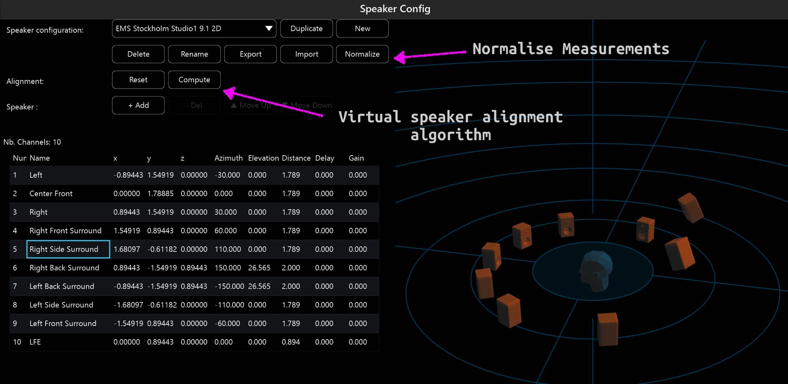
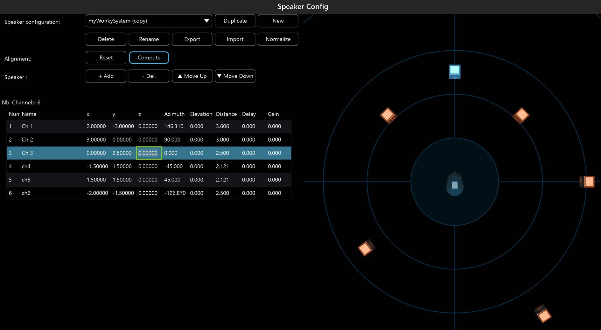
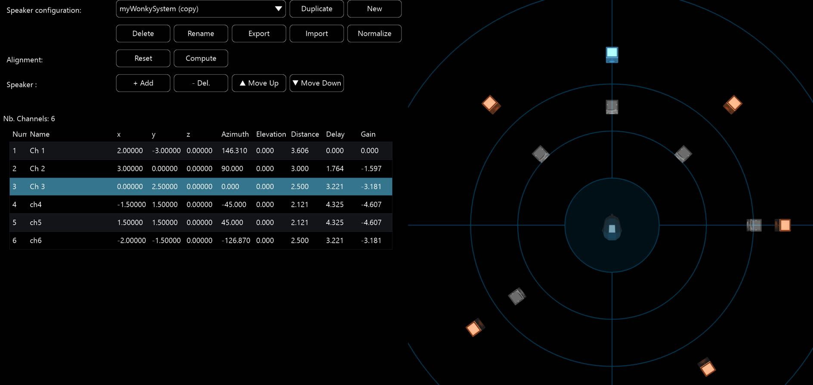

# 4.5 Custom Speaker Configuration

When you find yourself working on a multi-speaker installation which is not covered in the SPAT speaker arrangement presets, you can still get great results. This is
because Spat Revolution has an intelligent **Custom Speaker Configuration** editor
where a model of the sound diffusion system you are actually using can be defined
and stored into the list of presets.

Open the **Custom Speaker Configuration** editor by clicking on the EDIT button of
a Channel Based room, by the _Speaker Arrangement_ pull down menu. All Channel
Based speaker layout presets are stored, duplicatable and editable in the **Custom
Speaker Configuration** editor.

Spat Revolution can accept real world measurements which you have entered
manually, and can save this system as a speaker arrangement preset to be used in
all Channel Based contexts, such as simulating that exact physical system in a virtual room, binauralising or transcoding onto that channel based system from an Ambisonic source.

To create a custom preset, first of all, make a NEW or DUPLICATE an existing preset
from the menu. _Add_ , _Delete_ and _Move_ speakers. Importantly, **_LABEL_** speakers. You
can enter Angles, to map the model in Polar space, and Spat will calculate Cartesian distances. If you have X,Y,Z Cartesian co-ordinates measured from the origin of
(0,0,0) at the Listener Position, then Spat Revolution will take care of the polar
co-ordinates.

In addition, it can also use the measurements to compute the optimum delays and
gains for better spatial results on a custom speaker configuration. This is an advanced speaker management technique made easily accessible by a single press
of the **Compute Speaker Alignment** button.

When you have defined a custom speaker arrangement and press this button,
Spat revolution will create virtual speakers for the ones that are not at equal distances to listener. This becomes important when using speakers arrangements with
sweep spot centric panning methods as the algorithm will try to 'fill in the gaps'
and work out the best speaker weighting internally that will normalise and balance
the sound field towards an optimum decoding for the speaker and channel based
format being actually used.

The **_Normalise_** button is also useful, as it will remap real measured distances into a
normalised 'absolute' distance measure that should improve the perception of virtual sources' _Distance_ variable which is calculated as a simulated distance measure
between listener position and virtual speakers in a channel based configuration.

**Before Alignment Compute**

**After Alignment Compute**

A detailed tutorial on advanced scripting of Custom Speaker Configurations using
the Python language is available on line at the Flux:: support website.

