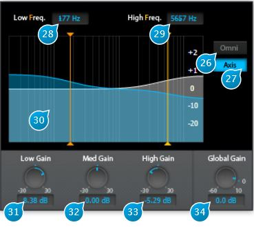

# Axis Omni Filters

## (26) Omni
Toggles the equalizer associated with the omnidirectional part of the sound radiated by the virtual
source. This equalizer mimics the global frequency-response of the source, just as a loudspeaker colors the sound.

## (27) Axis
Toggles the equalizer associated with the on-axis part of the sound radiated by the virtual source.  
Most, if not all commercially available loudspeakers do exhibit a radically different frequency 
response whether you're listening right in front or on the sides. Setting a rather flat on-axis equalizer
curve, and maybe cutting the treble and mids for the omni response would be a good starting point
to emulate a real-world speaker.

## (28) Low Freq.
Low-pass filter frequency cutoff of the currently selected equalizer. Value can be quickly adjusted using the mouse by
clicking and holding the value box or the vertical bar on the graphical frequency-response display, or exactly by clicking the
value box and entering a value with the keyboard.

## (29) High Freq.
High-pass filter frequency cutoff of the currently selected equalizer.

## (30) Axis - Omni Curves
Actual frequency response curve of the currently selected equalizer, expressed in dB (deciBel).  
Click and drag one of the three square points with your mouse to quickly change the gain of the corresponding band, or
one of the two vertical bars to adjust the transition frequencies of the bands.

## (31) Low Gain
Gain applied to the low frequency band of the currently selected equalizer.

## (32) Med Gain
Gain applied to the medium frequency band of the currently selected equalizer.

## (33) High Gain
Gain applied to the high frequency band of the currently selected equalizer.

## (34) Global Gain
Overall gain applied to the currently selected equalizer.
