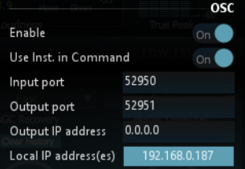

# Open Sound Control (OSC)

How to use the OSC protocol with LevelMagic(TM)

## The OSC protocol

The OSC protocol is a way of controlling devices via the network. Here we present a way of taking control of the
LevelMagic(TM) plug-in using this protocol.

## Using the Bonjour protocol, Zero Conf
If your control device uses bonjour or Zero conf protocol configuration will be quick and simple. Just select Flux::OSC
in the ZeroConf device of your controller. Then, write the output port and IP address of your device in the labels of
the plug-in. Remember that in the output port label of the plug-in you should write the input port of your controller
and in the output address of the plug-in you should write the IP address of your device.

## Configuring OSC parameters manually.
The following parameters are used to configure OSC manually in LevelMagic(TM)

- Network configuration: OSC is a network based protocol so make sure that both your controller and the host
    are connected to the same network.
- OSC Enable: When turned on this parameter creates a thread for receiving and sending OSC messages. This
    thread is multi-instances. This means that this will control all the instances of the plug-in. For example, if you
    have four LevelMagic(TM) opened, all the communication and control via OSC will be done via this one config-
    ured thread. You just have to be sure that the following parameters are well configured.
- Input Port: This is the port where the plug-in will be receiving OSC messages (the output of your control
    surface)
- Output Port: This is the port where the plug-in will send feedback to (the input of your control surface).
- Output IP Address: This is the address of destination of the outgoing OSC packets of the plug-in. You should
    write here the IP address of your controller

The image below presents the different OSC parameters used for configuration.

  

## Feedback from the plug-in to the controller

The Flux:: OSC manager will send feedback to your controller. These are the different situations when you will 
receive feedback:

- When a parameter begins to be edited  
In this situation, the plug-in will send the following OSC messages:  
    - Address Pattern: /NumberOfInstance/ControlBeginEdit  
    - Argument: Name of the parameter.  
    - Type: String

- When the edition of a parameter ends
    - Address Pattern: /NumberOfInstance/ControlEndEdit
    - Argument: Name Of the parameter
    - Type: String

- When a value is changed  
When a parameter is changed in the plug-in by any mean (OSC, mouse, automation or other... ) Flux :: Osc will
send a message with the new value of the parameter and the instance number of the plug-in it belongs to.
    - Address Pattern: /NumberOfInstance/ParameterName
    - Argument: Float from 0 to 1, represents the value of the parameter.
    - Type: Float

- When creating a new instance  
When a new instance of a plug-in is created Flux:: OSC will send the following message:
    - Address Pattern: /NewInstanceRegisteredWithNumber
    - Argument: The number assigned to the new instance created.
    - Type: Float

- When an instance of a plug-in is destroyed
    - Address Pattern: /InstanceUnregisteredWithNumber
    - Argument: Represents the index of the instance that was destroyed.
    - Type: Float,

## Using multiple controllers and advanced configurations 
Flux :: OSC gives you the possibility to use multiple controllers for one instance of a plug-in and have a particular
feedback for each one. If you want to use multiple controllers refer to the use of the /TalkToMeOnPort Command
found under “Commands”.

## Commands

### How to use the commands
At first you have to know what an OSC message is composed of. Mainly, these two parts: The Address Pattern and
the Argument.

For controlling parameters Flux:: only supports arguments of float type so make sure that the arguments you are
sending via your controller are Floats. Float arguments must always be from 0 to 1 for controlling a parameter so
you don’t have to deal with scale conversion.

### The LevelMagic(TM) OSC commands
When OSC is enabled in the Plug-in Settings (2) the file “OSC_Dict.xml” is automatically created in:  
/Documents/Flux/LevelMagic

This is a properties dictionary with each parameter that can be controlled and mapped using OSC. The commands
in the dictionary includes a ”Translation” attribute that can be used in order translate the OSC name into the Flux::
internal parameter name in both directions.

### Global Commands
Global commands allow you to access to some additional information. These commands don’t need an instance
number. These are the available additional commands:
- Address Pattern:/GetDeviceInfo
- Type: Float
- Value: 1
- Explanation: Get all the names of the controllable parameters

- Address Pattern: /TalkToMeOnPort
- Type: Float
- Value: Port Number
- Explanation: This command is very strong. It will store the IP address and the port in argument as an endpoint. All
the different messages will be sent to this endpoint. This command is very useful for using many controllers.

- Address Pattern: /GetCurrentValues
- Type: Float
- Value: 1
- Explanation: This command will send all the current values of the different instances of a plug-in. The structure of
the sent OSC messages is the same as the one for controlling them.

- Address Pattern: /GetNumberOfInstances
- Type: Float
- Value: 1
- Explanation: This command returns the opened number of instances of a plug-in. If you have five LevelMagic(TM)
opened this command will return 5.

