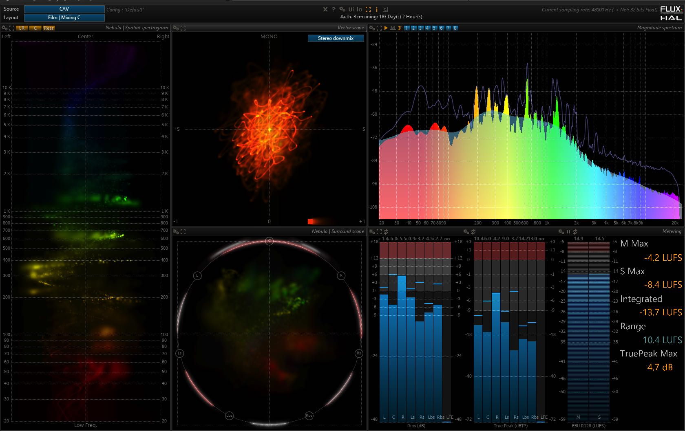
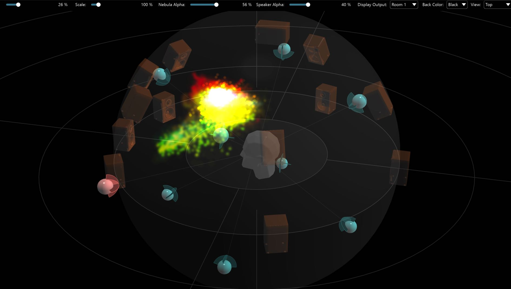

# 6.7.5 Nebula Spatial Spectrogram

_Nebula_ is a technology adapted from our flagship **Flux PURE Analyzer System** a
suite of highly regarded professional mastering and mixing visualisation tools.

Screeshot from a Flux Pure Analyzer session

**Nebula** in Spat Revolution provides a unique representation of the sound field in
terms of spectral content and localisation rendered directly inside the 3D speaker
simulation and virtual room display. It combines the functionality of a spectrum
analyser and a vector scope in a novel real-time display. It is a useful tool to get a
realtime overview of your spatial mix in terms of spectral-spatial diffusion, and can
give quite accurate representations of 'where' and 'how' sounds will manifest over
a real world sound system. A lot of work has gone into optimising the real-time
rendering of the display, not solely for æsthetic reasons, but because we wanted
the display to react instantly to all the details in the incoming multichannel audio.
The idea is literally for you to be able to see what the listener will hear and feel.

**How does it work?**

The overall principles behind _Nebula_ are quite straightforward. At any given time,
and for every frequency, the engine computes the position of a frequency in space
(2D in stereo and 3D for multi channel surround). This position is taken as the center of gravity of the various channels, weighted by the relative amplitude of the
signal in their corresponding channel. A colour-intensity mapped projection is
computed for the multi-speaker plane, giving a spectrum-space frame constrained
to the surround sound field radius or sphere. Past analysis frames are progressively
“forgotten”, using blur and dimming, in order to make place for new information,
which gives the graphic display increased legibility and its characteristic 'nebulous'
quality.

